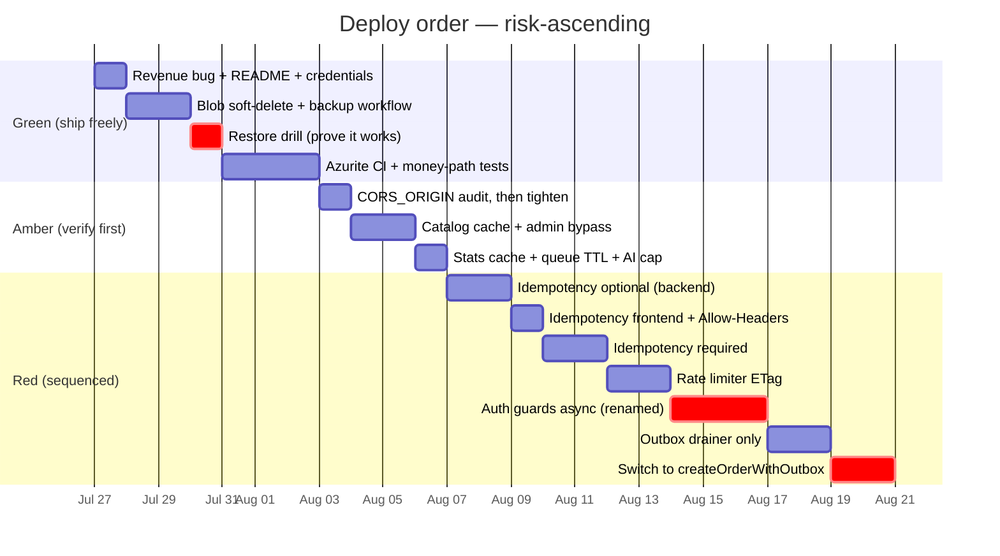

# Breaking-Change Assessment

**Companion to:** `docs/IMPLEMENTATION-GUIDE.md`
**Question answered:** *Will these changes break existing functionality?*
**Date:** 2026-07-25

---

## Short answer

**Most are safe. Four will break your site if deployed carelessly. One can silently bypass authentication.**

I checked each recommendation against your actual frontend code, not in the abstract. The dangerous ones are dangerous for a specific structural reason:

> **Your frontend and backend deploy from separate workflows with path filters.**
> `deploy-backend-prd.yml` triggers on `backend/**`; `deploy-frontend-prd.yml` triggers on `frontend/**`.
> A PR touching only the backend ships the backend alone. **There is no lockstep deploy.**

So any change that makes the backend require something new from the client is a live outage between the two deploys.

---

## Risk classification

| Change | Risk | What breaks if you get it wrong |
|---|---|---|
| §1 Revenue bug fix (`'paid'` → `'CAPTURED'`) | 🟢 Safe | Nothing |
| §2.5 Hoist `DefaultAzureCredential` | 🟢 Safe | Nothing |
| §2.7 README fix | 🟢 Safe | Nothing |
| §3.4 Extract after-cancel handler | 🟢 Safe | Nothing (pure refactor) |
| §6.2 Blob soft-delete / versioning | 🟢 Safe | Nothing |
| §6.3 Nightly backup workflow | 🟢 Safe | Nothing (read-only) |
| §4.4 Azurite CI | 🟢 Safe | Nothing (CI only) |
| §2.6 Queue message TTL | 🟡 Verify | Messages stuck >7 days silently vanish |
| §2.4 App Insights cap | 🟡 Verify | Telemetry stops if cap hit — app fine |
| §2.1 Catalog caching | 🟡 Verify | Admin edits look "not saved" for ≤60s |
| §2.2 Stats cache | 🟡 Verify | Dashboard up to 60s stale |
| §3.2 Rate limiter fail-closed | 🟡 Verify | Legitimate 429s under contention |
| §3.3 Admin token 24h → 8h | 🟡 Verify | Admins re-login more often |
| **§2.3 CORS tightening** | 🔴 **Breaks** | **Every API call from an unlisted origin** |
| **§3.1 Idempotency-Key required** | 🔴 **Breaks** | **All checkout, until frontend ships** |
| **§3.3 async `requireUser`/`requireAdmin`** | 🔴 **Auth bypass** | **A missed `await` authorises everyone** |
| **§4.2 `listPage` removes `total`** | 🔴 **Breaks** | **Admin orders pagination UI** |
| **§4.1 Outbox** | 🔴 **Breaks** | **New orders invisible in admin** |

---

## 🔴 The five that need care

### R-1 · CORS tightening (§2.3) — breaks everything from an unlisted origin

**Current behaviour:** when the request origin isn't in `CORS_ORIGIN`, `corsHeaders` still returns `Access-Control-Allow-Origin: <allowedOrigins[0]>`. If your frontend origin is *missing* from `CORS_ORIGIN` but happens to be the first entry's value — or if a caller relied on that fallback — it works today by accident.

**After the change:** no ACAO header at all. The browser blocks the request. Every API call from that origin fails.

**Before you merge:**

```bash
az functionapp config appsettings list \
  --resource-group rg-thesrilathaarts-prd \
  --name func-thesrilathaarts-prd \
  --query "[?name=='CORS_ORIGIN'].value | [0]" -o tsv
```

Confirm it lists **every** origin that legitimately calls the API:

- `https://www.srilatha.art`
- `https://srilatha.art` (apex, if it serves)
- the SWA default hostname `https://<something>.azurestaticapps.net`
- any preview/staging SWA hostname you use

**Rollback:** revert `response.ts`. Single file, no data migration.

---

### R-2 · Idempotency-Key required (§3.1) — breaks all checkout between deploys

**The trap:** if you merge a backend-only PR that makes the header mandatory, `POST /razorpay/create-order` returns `400` for every customer until the frontend deploy completes. Since the workflows are independent and the frontend build takes minutes, **that is a real checkout outage**.

**Deploy in three steps, never one:**

**Step 1 — backend accepts, does not require.** Ship this first:

```ts
  const idemKey = request.headers.get('idempotency-key')?.trim()

  // Phase 1: optional. Old clients (no header) keep working exactly as
  // before; new clients get dedupe protection. Flip to required only
  // after the frontend has shipped and traffic confirms adoption.
  if (idemKey && (idemKey.length < 16 || idemKey.length > 128)) {
    return errorResponse('Idempotency-Key must be 16-128 characters', 400, origin)
  }

  if (idemKey) {
    const existing = await claimIdempotencyKey(idemKey, requireUser(request)?.userId || 'guest')
    if (existing) {
      if (existing.status === 'done' && existing.responseJson) {
        return jsonResponse(JSON.parse(String(existing.responseJson)), 201, {}, origin)
      }
      return errorResponse('This checkout is already being processed. Please wait a moment.', 409, origin)
    }
  }
```

Guard the completion/release calls with `if (idemKey)` too.

**Step 2 — frontend sends it.** Also ship the CORS `Allow-Headers` addition (§2.3) **with or before** this, or the browser preflight rejects the new header:

```ts
'Access-Control-Allow-Headers': 'Content-Type, Authorization, X-CSRF-Token, If-None-Match, Idempotency-Key',
```

> Generate the key **once when the checkout form mounts**, not inside the submit handler. A key regenerated per click defeats the entire purpose — that is exactly the double-click you are defending against.

**Step 3 — make it required.** Only after telemetry shows ~100% of `create-order` calls carrying the header. Add a counter:

```ts
trackTelemetry('checkout.idempotency', { present: Boolean(idemKey) })
```

**Rollback:** at any step, revert to optional. No data migration; stale `idempotencyKeys` rows are swept automatically.

---

### R-3 · async auth guards (§3.3) — can silently authorise everyone

**This is the most dangerous change in the entire guide.**

`requireUser` and `requireAdmin` become `async`. At ~30 call sites the current code is:

```ts
const admin = requireAdmin(request)
if (!admin) return errorResponse('Unauthorized', 401, origin)
```

If a single call site is not updated, it now receives a **Promise**. A Promise is always truthy. `if (!admin)` is never true. **That endpoint stops checking authentication entirely** — and it will not throw, will not log, and will pass a smoke test.

**Do not do this as a plain signature change.** Rename so a missed site is a compile error:

```ts
// middleware/adminGuard.ts
export async function requireAdminAsync(request: HttpRequest): Promise<AdminContext | null> { ... }

/** @deprecated Removed — use requireAdminAsync. Kept only to break the build loudly. */
export function requireAdmin(_request: HttpRequest): never {
  throw new Error('requireAdmin is async now — use `await requireAdminAsync(request)`')
}
```

Delete the old export entirely once migrated. With the old name gone, `tsc` fails on every unmigrated site. That is the outcome you want.

**Verify before merging:**

```bash
cd backend
grep -rn "requireAdmin\|requireUser\|requireSuperAdmin" src --include=*.ts \
  | grep -v "Async" | grep -v "middleware/"
# must return nothing

npx tsc --noEmit    # must be clean
```

**Also add a regression test** — this is worth the twenty minutes:

```ts
it('rejects an unauthenticated admin request', async () => {
  const res = await adminGetStats(mkRequest({ headers: {} }), mkContext())
  expect(res.status).toBe(401)
})
```

**Backward compatibility of the token itself is fine.** Existing JWTs have no `tokenVersion` claim; `Number(undefined ?? 0)` is `0`, and stored rows also have no `tokenVersion`, so `0 !== 0` is false and the token passes. **Nobody gets logged out by the deploy.** Verified against the code in §3.3.

---

### R-4 · `listPage` removes `total` (§4.2) — breaks admin pagination UI

**Verified against your code.** `frontend/app/admin/orders/page.tsx`:

```
line 110   const total = data?.total ?? 0
line 111   const totalPages = Math.ceil(total / PAGE_SIZE)
line 366   <span>Page {page} of {totalPages} ({total} orders)</span>
line 377   disabled={page === totalPages}
```

Drop `total` and `totalPages` becomes `0`. The pager disappears (`totalPages > 1` is false) and the Next button is permanently disabled — **the admin can only ever see page 1 of orders.**

**Two options:**

**Option A — keep `total`, defer the fix.** The scan is only expensive on the unfiltered admin path. Status-filtered listing already uses the `ordersByStatus` index. At studio volume this can wait; take the caching wins first.

**Option B — migrate together.** Backend returns `{ rows, continuationToken }`; frontend switches to Next/Previous with a token stack:

```ts
const [tokens, setTokens] = useState<(string | undefined)[]>([undefined])
const [pageIdx, setPageIdx] = useState(0)
// Next: push data.continuationToken, pageIdx + 1
// Prev: pageIdx - 1 (token already in the stack)
// "Page N of M" becomes "Page N" — you cannot know M without counting
```

Ship backend and frontend in the **same PR** so the path filters trigger both workflows.

**My recommendation: Option A for now.** This is the lowest-value item on the list and the highest UI churn. Revisit when the orders table is large enough to feel slow.

---

### R-5 · Outbox (§4.1) — new orders invisible in admin if sequenced wrong

`createOrderWithOutbox` writes only the order row + outbox row. `orderItems`, `ordersByStatus`, and `ordersByRazorpayId` are written by the drainer. If the drainer is not running, orders exist but:

- do not appear in the admin list (which reads `ordersByStatus`)
- have no line items on the detail page
- fall back to a full scan on payment verify

**Mandatory sequence — three separate deploys:**

1. **Deploy the drainer alone.** It runs, finds nothing, does nothing. Confirm both triggers registered in the portal's Functions list.
2. **Create the `outbox-drain` queue** (add to `$queueNames`, re-run the infra script). Verify it exists in the storage account.
3. **Only then** switch `createPaymentOrder` to `createOrderWithOutbox`.

**Verify in DEV first with a real order.** Place one, then check within ~10s:

```
orders table          → order row + ~outbox_<id> row
after drain (seconds) → outbox row gone, ordersByStatus has the row
admin orders list     → order visible
admin order detail    → line items present
```

**Two subtleties I want to flag:**

**(a) The `RowKey lt '~'` filter must ship with it.** Outbox rows live in the `orders` table. Until `getAllOrders` and `getOrdersByUser` exclude them, they appear as ghost orders in the admin list and in customer order history. Both changes go in the same commit.

**(b) In-flight orders during the switch.** Orders created by the *old* code path already have their projections. Orders created by the *new* path need the drainer. There is no migration — the two coexist cleanly. But do not deploy this during peak checkout hours.

**Rollback:** revert `createPaymentOrder` to the direct writes. Leave the drainer deployed; it idles harmlessly. Any outbox rows already written get drained and cleaned up.

---

## 🟡 The five worth verifying

### A-1 · Catalog caching makes admin edits look broken (§2.1)

**Verified flow:** `frontend/app/admin/products/edit/page.tsx:216-217` does `PATCH /admin/products/{id}` then `router.push('/admin/products')`.

`invalidateCatalog()` clears the cache **on the instance that handled the PATCH**. On Consumption you may have several warm instances. The subsequent list `GET` can land on a different one and serve up-to-60s-stale data. The admin sees their edit missing, hits save again, and files a bug.

**Fix — make admin reads bypass the cache.** Admin volume is negligible, so there is nothing to gain from caching it:

```ts
// tableStorage.ts
export async function getAllProductsUncached(): Promise<Row[]> {
  const rows = await listAll('products')
  return rows.sort((a, b) => (a.sortOrder ?? 0) - (b.sortOrder ?? 0))
}
```

Use it in `productAdmin.ts`, and set `Cache-Control: no-store` on all admin product responses.

**Also: do not cache `getProductById`.** Repeating the warning from the guide because the consequence is expensive — `reserveStock` reads it to make inventory decisions, and stale stock data oversells one-of-one artwork.

**Public-side staleness (≤60s on the storefront) is fine** and is the entire point. Start at `CATALOG_CACHE_TTL_MS=30000` if you want to be cautious; it is env-configurable by design.

### A-2 · Do not manually send `If-None-Match` (§2.1)

Your `apiFetch` treats any non-2xx as an error (`api.ts:164`). A `304` has `response.ok === false`, so a manual conditional request would throw `ApiError`.

**You do not need to send it.** The browser's HTTP cache handles revalidation automatically and surfaces a synthesised `200` to `fetch()`. Just add the `Cache-Control` and `ETag` response headers and let the browser do its job. Adding `If-None-Match` to `Allow-Headers` is harmless future-proofing — do not wire it up in `apiFetch`.

### A-3 · Rate limiter now fails closed (§3.2)

Today, losing the read-modify-write race means the request is *allowed* (undercounting). After the change, exhausting ETag retries returns `allowed: false` — a `429`.

For a security control this is correct. But it means a burst of legitimate concurrent logins (a family sharing an IP, an office NAT) could see a spurious 429 where they previously did not.

**Verify:** check current limits are not already tight. The review notes coupon-validate at 5/min/IP — that is low for a shared NAT. Consider raising it while making the limiter actually work.

### A-4 · Queue TTL (§2.6)

`messageTimeToLive: -1` → 7 days means a message stuck behind a persistent failure is deleted rather than retried forever. That is the intent. Confirm nothing in your ops process depends on manually re-driving month-old queue messages.

### A-5 · Admin session 8h (§3.3)

Purely a UX change. If the studio's working pattern is "log in Monday, stay logged in all week", 8h will annoy. With `tokenVersion` revocation in place, 24h is defensible — the reason to shorten was the absence of revocation. **Consider keeping 24h once revocation ships.**

---

## Recommended safe order



Two hard rules:

1. **The restore drill (g3) gates everything after it.** You are about to modify the code that writes your order data. Prove you can recover *first*.
2. **Nothing red ships on a Friday**, and nothing red ships during IST evening peak.

---

## Pre-merge checklist for every red change

- [ ] Deployed to DEV and exercised the *actual user flow*, not just a health check
- [ ] `npx tsc --noEmit` clean in `backend/`
- [ ] `npm test` passing in `backend/`
- [ ] `npx playwright test` passing from repo root against DEV
- [ ] Rollback path written down before merging, not after
- [ ] Deployed outside IST business hours
- [ ] `/api/health` returns 200 post-deploy
- [ ] One real end-to-end test order placed in DEV, verified through to invoice email

---

## Azure resource impact

**Almost all of it is code. Six things touch Azure, none of them destructive.**

Nothing deletes, replaces, resizes, or migrates an existing resource. There is no downtime from any Azure-side change, and every one is reversible with a single command.

### The six Azure changes

| # | Change | Resource | Type | Reversible |
|---|---|---|---|---|
| 1 | Blob soft-delete + versioning | Storage account (blob service) | Config update | Yes — same command, `false` |
| 2 | Log Analytics daily cap | Log Analytics workspace | Config update | Yes — remove quota |
| 3 | `outbox-drain` queue | Storage account (queues) | **New** sub-resource | Yes — delete queue |
| 4 | `idempotencyKeys`, `counters` tables | Storage account (tables) | **New** sub-resource | Yes — delete tables |
| 5 | `Storage Table Data Reader` for CI SP | Storage account (IAM) | **New** role assignment | Yes — remove assignment |
| 6 | New functions appear in the Function App | Function App | Ships in the code zip | Yes — revert code |

### Detail on each

**1. Blob soft-delete + versioning** — the only one with a cost implication (a few ₹/month, see guide §6.2). It is a property flip on the existing blob service; existing blobs are untouched and nothing restarts.

**2. Log Analytics daily cap** — note the real behaviour: when the cap is hit, **ingestion stops for the rest of the day**. That is the point (it guarantees no bill), but you lose telemetry until midnight UTC. Set it generously — `0.16 GB/day` is the free grant, and you are nowhere near it today.

**3. `outbox-drain` queue** — **must exist before the producer runs.** Verified: nothing in your codebase calls `createIfNotExists` on a queue, and `enqueue()` in `queue.ts` will throw if the queue is missing. The Functions queue-trigger extension usually auto-creates it on startup, but do not rely on that. Add `'outbox-drain'` to `$queueNames` and re-run the infra script.

**4. New tables — actually self-provisioning.** Your `ensureTable` helper creates tables on first use, and the Function App's managed identity holds `Storage Table Data Contributor`, which includes table creation. Eight tables already work this way (`cart`, `wishlist`, `emailLogs`, `ordersByRazorpayId`, …). My `idempotencyKeys` and `counters` code uses `ensureTable`, so **they appear on their own with no Azure action.** Still add them to `$tableNames` so the script stays honest — that is finding M-3.

**5. Role assignment for backups** — one-time. Your CI service principal currently holds only `Website Contributor`; the nightly export needs table read access. Free, and scoped to the one storage account.

**6. New functions** — `outboxDrain` (queue) and `outboxSweep` (timer) ship inside the deployment zip. No portal action. Two things to know: the timer **starts firing on its schedule immediately** on deploy, and you should confirm both appear in the Function App's function list afterwards.

### App settings: none required

All three env vars I introduced have working defaults:

```ts
CATALOG_CACHE_TTL_MS  → defaults to 60_000
OUTBOX_QUEUE_NAME     → defaults to 'outbox-drain'
JWT_SECRET_PREVIOUS   → defaults to '' (only needed during a rotation)
```

**This matters:** `az functionapp config appsettings set` **restarts the Function App**. Since none of these are required, you can ship everything without a config-induced restart. Set them later, deliberately, only if you want to tune.

### What stays purely code

Everything else — the revenue bug, CORS, ETag and cache headers, credential hoisting, queue TTL, the rate-limiter ETag, `tokenVersion`, the extracted after-cancel handler, `listPage`, and all outbox application logic. These ride the normal `deploy-backend-prd.yml` path with no Azure-side action at all.

`tokenVersion` deserves a note: it is a **new field on existing rows** in a schema-less store. No migration, no `ALTER TABLE`. Rows without it read as `0`, which is exactly what unversioned tokens carry — that is why nobody gets logged out.

### The one-time Azure setup, start to finish

```bash
# 1. Blob durability (the important one)
az storage account blob-service-properties update \
  --resource-group rg-thesrilathaarts-prd \
  --account-name stthesrilathaartsprd \
  --enable-delete-retention true --delete-retention-days 14 \
  --enable-container-delete-retention true --container-delete-retention-days 14 \
  --enable-versioning true

# 2. Queue for the outbox (only when you reach Phase 2)
az storage queue create \
  --name outbox-drain \
  --account-name stthesrilathaartsprd \
  --auth-mode login

# 3. Backup read access for CI
az role assignment create \
  --assignee <sp-github-actions-thesrilathaarts-prd-object-id> \
  --role "Storage Table Data Reader" \
  --scope /subscriptions/<sub-id>/resourceGroups/rg-thesrilathaarts-prd/providers/Microsoft.Storage/storageAccounts/stthesrilathaartsprd

# 4. Telemetry spend guard
az monitor log-analytics workspace update \
  --resource-group rg-thesrilathaarts-prd \
  --workspace-name <your-law-name> \
  --daily-quota-gb 0.16
```

Run these on **DEV first**. Then fold each into `Deploy-Infrastructure-v2.ps1` (phases 4, 4, 9, and 2.3 respectively) so a future re-run does not silently revert them — the script is currently the only thing standing between you and configuration drift.

---

## What I would actually do this week

Given the constraint and the risk profile, my honest recommendation:

**Do now (zero risk, real value):**

1. Revenue bug fix — your dashboard reads ₹0 today
2. Blob soft-delete + versioning
3. Nightly backup workflow **and one restore drill**
4. Credential hoisting, README, queue TTL

**Do next (verify, then ship):**

5. Audit `CORS_ORIGIN`, then tighten
6. Catalog caching with admin bypass

**Do deliberately, over several weeks:**

7. Idempotency in three steps
8. Auth guards with the rename trick and a regression test

**Defer:**

9. Outbox — high value, but it is the riskiest change and deserves the Azurite tests first
10. `listPage` — lowest value, highest UI churn. Option A.

The first four are an afternoon, carry no risk, and include the only thing on this list that protects the business rather than improving it.
