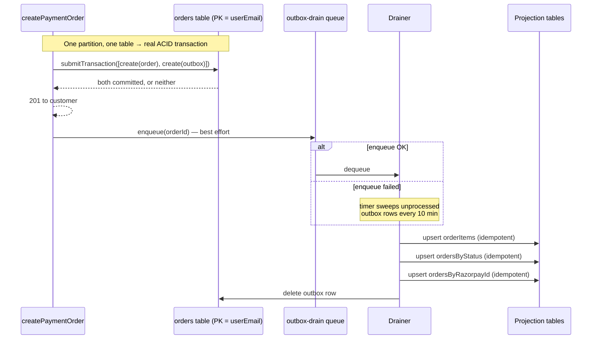
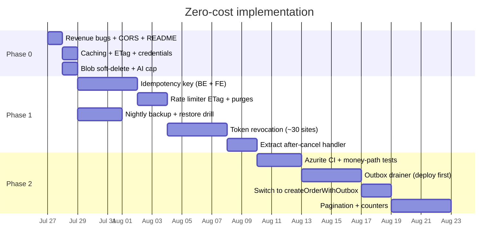

# Zero-Cost Implementation Guide

**Companion to:** `docs/SYSTEM-DESIGN-REVIEW.md`
**Constraint:** No additional Azure spend.
**Date:** 2026-07-25

---

## 0. Cost verdict up front

Good news: **most of the review is free, and the biggest items actually reduce your bill.**

Azure Table Storage bills per 10,000 transactions. Every `getAllOrders()` on an admin page load is N entity reads. Every uncached `/api/products` hit is a full table read. Killing those is not a cost — it's a refund.

| # | Item | Cost impact |
|---|---|---|
| H-2 | Cache-Control + ETag + in-process cache | **Saves money** — large |
| H-1 | Kill full-table scans, real pagination | **Saves money** — large |
| C-2 | Idempotency key | **Saves money** — fewer duplicate orders |
| C-1 | Transactional outbox | Neutral (same writes, reordered) |
| H-4 | Rate limiter ETag + purge | **Saves money** — table stops growing |
| H-3 | tokenVersion revocation | Neutral (cached point read) |
| M-1,2,3,6,7 | Code-quality fixes | Free |
| L-1,2,3,6,7 | Versioning, credentials, TTL, tracing, rotation | Free |
| L-4 | Tests + Azurite in CI | Free (within GitHub free tier) |
| M-4 | Bicep port | Free |
| **C-3** | **Backup / DR** | **See §6 — free path exists** |
| L-5 | Exclude Exception from sampling | Slight increase — capped in §2.4 |
| ~~M-5~~ | ~~Premium plan for slots~~ | **Dropped — costs money** |
| ~~C-3~~ | ~~Standard_GRS~~ | **Dropped — ~2× storage cost** |
| ~~§7~~ | ~~Azure SQL migration~~ | **Dropped — deferred, see §8** |

Three items are cut. Section 8 states exactly what risk you are accepting by cutting them.

---

## 1. Two live bugs found while writing this

Not in the original review — I found these while reading the code to write the fixes. Both are free to fix and both are wrong right now in production.

### BUG-1 · Admin dashboard revenue is always ₹0

`backend/src/functions/adminStats.ts:40`

```ts
if (order.paymentStatus === 'paid') {
  totalRevenue += Number(order.displayTotal ?? 0)
}
```

`paymentStatus` is never `'paid'`. The type is `'PENDING' | 'CAPTURED' | 'FAILED' | 'REFUNDED' | 'COD'` (`types/index.ts:48`), and the codebase writes `'CAPTURED'` in 8 places. The comparison never matches, so `totalRevenue` is always `0`.

### BUG-2 · Customer lifetime value is always 0

`backend/src/functions/adminCustomers.ts:65` — same comparison, same bug.

**Fix both:**

```ts
// adminStats.ts:40  and  adminCustomers.ts:65
if (order.paymentStatus === 'CAPTURED') {
```

**Prevent recurrence** — stop comparing raw strings. In `backend/src/types/index.ts`:

```ts
export const PAYMENT_CAPTURED: PaymentStatus = 'CAPTURED'

/** Payment states that count as money actually received. */
export const REVENUE_COUNTING_STATUSES: ReadonlySet<PaymentStatus> =
  new Set<PaymentStatus>(['CAPTURED'])

export function countsAsRevenue(s: unknown): boolean {
  return typeof s === 'string' && REVENUE_COUNTING_STATUSES.has(s as PaymentStatus)
}
```

Then `if (countsAsRevenue(order.paymentStatus))` in both call sites. A typo now fails at compile time.

---

## 2. Phase 0 — one afternoon, all free

### 2.1 Cache the catalog (H-2) — the single biggest win

**Step 1.** Add an ETag helper to `backend/src/utils/response.ts`:

```ts
import { createHash } from 'crypto'

/**
 * Weak ETag over a response payload. Cheap: hashes the serialised body.
 * Pair with `notModified()` to turn repeat reads into 304s — no Table
 * Storage transaction, no egress, no function execution time billed
 * beyond the hash.
 */
export function etagFor(payload: unknown): string {
  const hash = createHash('sha1').update(JSON.stringify(payload)).digest('base64url')
  return `W/"${hash}"`
}

export function ifNoneMatch(request: { headers: { get(n: string): string | null } }): string | null {
  return request.headers.get('if-none-match')
}

export function notModified(
  etag: string,
  cacheControl: string,
  origin?: string | null,
): HttpResponseInit {
  return {
    status: 304,
    headers: { ...corsHeaders(origin), ETag: etag, 'Cache-Control': cacheControl },
  }
}
```

**Step 2.** Apply it in `backend/src/functions/products.ts`. Replace line 75:

```ts
    const payload = { products: rows.map(toApi) }
    const etag = etagFor(payload)
    const cacheControl = 'public, max-age=60, s-maxage=300, stale-while-revalidate=600'

    if (ifNoneMatch(request) === etag) {
      return notModified(etag, cacheControl, origin)
    }

    return jsonResponse(payload, 200, { ETag: etag, 'Cache-Control': cacheControl }, origin)
```

And line 95 for the single-product route:

```ts
    const payload = { product: toApi(row) }
    const etag = etagFor(payload)
    const cacheControl = 'public, max-age=120, s-maxage=600, stale-while-revalidate=1200'

    if (ifNoneMatch(request) === etag) {
      return notModified(etag, cacheControl, origin)
    }

    return jsonResponse(payload, 200, { ETag: etag, 'Cache-Control': cacheControl }, origin)
```

Remember to import `etagFor, ifNoneMatch, notModified` at the top.

**Step 3.** Add a module-scope TTL cache in `backend/src/services/tableStorage.ts`, just below the `_tableEnsured` block:

```ts
// ─── In-process read cache ───────────────────────────────────
//
// Per-instance, per-cold-start. Not distributed — two warm Function
// instances hold independent copies, so the effective staleness bound
// is TTL, not TTL × instances. That is acceptable for catalog reads:
// a product edit is visible everywhere within CATALOG_TTL_MS.
//
// Writes call invalidateCatalog() so the editing instance is immediately
// correct; other instances converge within the TTL.
//
// Zero infrastructure cost. Removes the majority of Table Storage
// transactions on the hottest path.

const CATALOG_TTL_MS = Number(process.env.CATALOG_CACHE_TTL_MS) || 60_000
const _cache = new Map<string, { value: unknown; expiresAt: number }>()

async function cached<T>(key: string, ttlMs: number, load: () => Promise<T>): Promise<T> {
  const hit = _cache.get(key)
  if (hit && hit.expiresAt > Date.now()) return hit.value as T
  const value = await load()
  _cache.set(key, { value, expiresAt: Date.now() + ttlMs })
  return value
}

export function invalidateCatalog(): void {
  for (const k of _cache.keys()) {
    if (k.startsWith('products:')) _cache.delete(k)
  }
}
```

Wrap the catalog readers:

```ts
export async function getAllProducts(): Promise<Row[]> {
  return cached('products:all', CATALOG_TTL_MS, async () => {
    const rows = await listAll('products')
    return rows.sort((a, b) => (a.sortOrder ?? 0) - (b.sortOrder ?? 0))
  })
}

export async function getProductsByCategory(category: string): Promise<Row[]> {
  return cached(`products:cat:${category}`, CATALOG_TTL_MS, async () => {
    const rows = await listAll('products', odata`PartitionKey eq ${category}`)
    return rows.sort((a, b) => (a.sortOrder ?? 0) - (b.sortOrder ?? 0))
  })
}
```

And invalidate on write:

```ts
export async function upsertProduct(product: Row): Promise<void> {
  const client = getTableClient('products')
  await client.upsertEntity(product as any, 'Replace')
  invalidateCatalog()
}

export async function deleteProduct(category: string, productId: string): Promise<void> {
  const client = getTableClient('products')
  await client.deleteEntity(category, productId)
  invalidateCatalog()
}
```

> **Important:** do **not** cache `getProductById` — `reserveStock` reads it to make inventory decisions. Stale stock data causes overselling. The derived filters (`getFeaturedProducts`, `getNewArrivals`, `getBestSellers`, `getOnSaleProducts`) all call `getAllProducts()`, so they inherit the cache for free.

### 2.2 Cache the admin stats response (H-1, cheap interim)

The proper fix is incremental counters (§4.3). The five-minute version, in `adminStats.ts`, right after the `requireAdmin` check:

```ts
// Dashboard is polled; recomputing three full-table reads per poll is
// the single most expensive thing this API does. 60s staleness on a
// stats tile is invisible to the user.
const STATS_TTL_MS = 60_000
let _statsCache: { value: unknown; expiresAt: number } | null = null
```

```ts
  if (_statsCache && _statsCache.expiresAt > Date.now()) {
    return jsonResponse(_statsCache.value, 200,
      { 'Cache-Control': 'private, max-age=60' }, origin)
  }
  // ... existing computation ...
  const payload = { totalRevenue: /* ... */ }
  _statsCache = { value: payload, expiresAt: Date.now() + STATS_TTL_MS }
  return jsonResponse(payload, 200, { 'Cache-Control': 'private, max-age=60' }, origin)
```

### 2.3 Fix CORS on disallowed origins (M-6)

`backend/src/utils/response.ts:8-23`:

```ts
export function corsHeaders(origin?: string | null): Record<string, string> {
  // Only emit CORS headers for an origin we actually allow. Emitting a
  // valid-looking ACAO for a rejected origin makes the allowlist harder
  // to test and reason about, even though browsers block the mismatch.
  if (!origin || !allowedOrigins.includes(origin)) {
    return { Vary: 'Origin' }
  }

  return {
    'Access-Control-Allow-Origin': origin,
    'Access-Control-Allow-Credentials': 'true',
    'Access-Control-Allow-Methods': 'GET, POST, PUT, PATCH, DELETE, OPTIONS',
    'Access-Control-Allow-Headers': 'Content-Type, Authorization, X-CSRF-Token, If-None-Match, Idempotency-Key',
    'Access-Control-Expose-Headers': 'Set-Cookie, ETag',
    'Access-Control-Max-Age': '600',
    Vary: 'Origin',
  }
}
```

Note the two additions to `Allow-Headers` (`If-None-Match`, `Idempotency-Key`) and `Expose-Headers` (`ETag`) — §2.1 and §3.1 need them.

> **Test this against production origins before merging.** If any legitimate caller's origin is missing from `CORS_ORIGIN`, it worked by accident before and will break now. Check the env var on both DEV and PRD first.

### 2.4 App Insights: keep exceptions, cap the spend (L-5)

Excluding `Exception` from sampling raises ingestion volume. Free tier is 5 GB/month. Add a **daily cap** so overage is structurally impossible.

`backend/host.json`:

```jsonc
"samplingSettings": {
  "isEnabled": true,
  "excludedTypes": "Request;Exception"
}
```

Then cap ingestion (one-time, free, prevents any bill):

```bash
az monitor app-insights component update \
  --resource-group rg-thesrilathaarts-prd \
  --app <your-appinsights-name> \
  --workspace <your-law-resource-id>

az monitor log-analytics workspace update \
  --resource-group rg-thesrilathaarts-prd \
  --workspace-name <your-law-name> \
  --daily-quota-gb 0.16
```

`0.16 GB/day ≈ 5 GB/month` — the free grant. Ingestion stops for the day if exceeded rather than billing you. Add this to `Deploy-Infrastructure-v2.ps1` Phase 2.3 so it survives a re-run.

### 2.5 Hoist credential construction (L-2)

`backend/src/functions/health.ts` — move to module scope:

```ts
const accountName = process.env.AZURE_STORAGE_ACCOUNT_NAME
// Credential chain discovery is not free; construct once per process.
const credential = new DefaultAzureCredential()
```

Delete the `const credential = new DefaultAzureCredential()` inside `probeStorage` (line 50).

Same in `backend/src/functions/staleReservationCleanup.ts` — one module-scope `credential`, referenced by both client factories (lines 52 and 60).

### 2.6 Bound queue message lifetime (L-3)

`backend/src/services/queue.ts:27`:

```ts
  await client.sendMessage(encoded, {
    visibilityTimeout: 0,
    messageTimeToLive: 7 * 24 * 60 * 60, // 7 days — bounds the poison queue
  })
```

### 2.7 Fix the README (M-4)

`README.md:12`:

```markdown
- `infra/` - PowerShell provisioning scripts for the Azure deployment.
  (Declarative Bicep port is planned — see docs/SYSTEM-DESIGN-REVIEW.md M-4.)
```

### 2.8 Phase 0 checklist

- [ ] BUG-1 + BUG-2: `'paid'` → `'CAPTURED'`, add `countsAsRevenue()`
- [ ] ETag + Cache-Control on `/api/products` and `/api/products/{id}`
- [ ] In-process catalog TTL cache + invalidation on write
- [ ] 60s stats cache in `adminStats.ts`
- [ ] `corsHeaders` omits ACAO for non-allowlisted origins (**verify `CORS_ORIGIN` first**)
- [ ] `excludedTypes: "Request;Exception"` + Log Analytics daily cap
- [ ] Hoist `DefaultAzureCredential` in `health.ts`, `staleReservationCleanup.ts`
- [ ] `messageTimeToLive: 7 days`
- [ ] README infra line corrected

---

## 3. Phase 1 — correctness, all free

### 3.1 Idempotency key on order creation (C-2)

**Step 1.** Add the table to `infra/Deploy-Infrastructure-v2.ps1:182`:

```powershell
    'emailLogs', 'whatsappMessages', 'whatsappConversations',
    'idempotencyKeys'
```

**Step 2.** Add to `backend/src/services/tableStorage.ts`:

```ts
// ─── IDEMPOTENCY ─────────────────────────────────────────────
//
// createEntity throwing 409 EntityAlreadyExists is the dedupe signal —
// it is an atomic test-and-set within one partition, which is exactly
// the primitive we need and the only one Table Storage gives us.
//
// Rows are swept by the stale-reservation timer (same schedule, no new
// trigger). No new cost: one tiny row per checkout attempt.

export class DuplicateRequestError extends Error {
  existing: Row | null
  constructor(existing: Row | null) {
    super('Duplicate request')
    this.name = 'DuplicateRequestError'
    this.existing = existing
  }
}

/**
 * Claim an idempotency key. Returns null on first use.
 * Returns the stored row if this key was already used.
 */
export async function claimIdempotencyKey(
  key: string,
  userEmail: string,
): Promise<Row | null> {
  const client = await ensureTable('idempotencyKeys')
  try {
    await client.createEntity({
      partitionKey: 'idem',
      rowKey: key,
      userEmail,
      status: 'in_flight',
      createdAt: new Date().toISOString(),
    } as any)
    return null
  } catch (err: any) {
    if (err?.statusCode === 409) {
      try {
        return (await client.getEntity('idem', key)) as Row
      } catch {
        return null
      }
    }
    throw err
  }
}

/** Store the successful response so a replay returns the same order. */
export async function completeIdempotencyKey(
  key: string,
  responseJson: string,
): Promise<void> {
  const client = await ensureTable('idempotencyKeys')
  await client.updateEntity(
    { partitionKey: 'idem', rowKey: key, status: 'done', responseJson,
      completedAt: new Date().toISOString() } as any,
    'Merge',
  )
}

/** Release a claim whose request failed, so the client can retry cleanly. */
export async function releaseIdempotencyKey(key: string): Promise<void> {
  const client = await ensureTable('idempotencyKeys')
  try {
    await client.deleteEntity('idem', key)
  } catch (err: any) {
    if (err?.statusCode !== 404) throw err
  }
}
```

**Step 3.** Wire into `createPaymentOrder` in `backend/src/functions/payments.ts`, immediately after the CSRF check:

```ts
  // ── Idempotency ────────────────────────────────────────────────
  // Without this, a double-clicked checkout reserves stock twice. On
  // one-of-one artwork the customer locks themselves out of the piece
  // they are trying to buy for RESERVATION_TIMEOUT_MINUTES.
  const idemKey = request.headers.get('idempotency-key')?.trim()
  if (!idemKey || idemKey.length < 16 || idemKey.length > 128) {
    return errorResponse('Idempotency-Key header is required', 400, origin)
  }

  const existing = await claimIdempotencyKey(idemKey, requireUser(request)?.userId || 'guest')
  if (existing) {
    if (existing.status === 'done' && existing.responseJson) {
      return jsonResponse(JSON.parse(String(existing.responseJson)), 201, {}, origin)
    }
    // Still in flight — the first request is mid-checkout.
    return errorResponse(
      'This checkout is already being processed. Please wait a moment.',
      409, origin,
    )
  }
```

Then in the success path, replace the final `return jsonResponse(...)` with:

```ts
    const responsePayload = {
      order: { /* ... unchanged ... */ },
      keyId: getPublicKeyId(),
    }
    await completeIdempotencyKey(idemKey, JSON.stringify(responsePayload))
    return jsonResponse(responsePayload, 201, {}, origin)
```

And release the key on every early return that rolls back. The cleanest way is to wrap the existing `rollbackReservations` so the two always happen together:

```ts
  const rollbackAll = async (): Promise<void> => {
    await rollbackReservations()
    await releaseIdempotencyKey(idemKey).catch(() => {})
  }
```

Then replace each `await rollbackReservations()` call with `await rollbackAll()`.

**Step 4.** Frontend — generate the key once per checkout attempt, not per retry. In `frontend/lib/api.ts` or your checkout handler:

```ts
// Generated when the user opens checkout, reused across retries of the
// same attempt. crypto.randomUUID() is available in all target browsers.
const idempotencyKey = crypto.randomUUID()

await fetch(`${API_BASE}/api/razorpay/create-order`, {
  method: 'POST',
  credentials: 'include',
  headers: {
    'Content-Type': 'application/json',
    'X-CSRF-Token': csrfToken,
    'Idempotency-Key': idempotencyKey,
  },
  body: JSON.stringify(payload),
})
```

**Step 5.** Sweep old keys — add to the existing timer in `staleReservationCleanup.ts` (no new trigger, no new cost):

```ts
async function purgeExpiredIdempotencyKeys(context: InvocationContext): Promise<void> {
  const cutoff = new Date(Date.now() - 24 * 60 * 60 * 1000).toISOString()
  const client = new TableClient(
    `https://${accountName}.table.core.windows.net`, 'idempotencyKeys', credential)
  let purged = 0
  for await (const row of client.listEntities<Row>({
    queryOptions: { filter: odata`PartitionKey eq 'idem' and createdAt lt ${cutoff}` },
  })) {
    try { await client.deleteEntity('idem', String(row.rowKey)); purged++ } catch { /* raced */ }
  }
  if (purged) context.log(`purged ${purged} expired idempotency keys`)
}
```

### 3.2 Make the rate limiter atomic (H-4)

`backend/src/services/rateLimit.ts` — the pattern already exists in `reserveStock`; reuse it.

```ts
import { TableClient, odata } from '@azure/data-tables'
import { DefaultAzureCredential } from '@azure/identity'

const accountName = process.env.AZURE_STORAGE_ACCOUNT_NAME!
const credential = new DefaultAzureCredential()
const client = new TableClient(
  `https://${accountName}.table.core.windows.net`, 'rateLimits', credential)

const MAX_RETRIES = 3

export async function checkAndIncrement(
  key: string, limit: number, windowMs: number,
): Promise<RateLimitResult> {
  for (let attempt = 1; attempt <= MAX_RETRIES; attempt++) {
    const now = Date.now()
    let counter: Row | null = null
    try {
      counter = (await client.getEntity('counter', key)) as Row
    } catch (err: any) {
      if (err?.statusCode !== 404) throw err
    }

    // Fresh window — createEntity is an atomic test-and-set. A 409 means
    // a concurrent request created it first, so loop and read theirs.
    if (!counter || !counter.windowStart || (now - Number(counter.windowStart)) >= windowMs) {
      try {
        await client.upsertEntity(
          { partitionKey: 'counter', rowKey: key, count: 1, windowStart: now,
            updatedAt: new Date().toISOString() } as any,
          'Replace',
          counter?.etag ? { etag: counter.etag as string } : undefined,
        )
        return { allowed: true, remaining: limit - 1, resetAt: now + windowMs }
      } catch (err: any) {
        if (err?.statusCode === 412 && attempt < MAX_RETRIES) continue
        if (err?.statusCode === 412) return { allowed: false, remaining: 0, resetAt: now + windowMs }
        throw err
      }
    }

    const count = Number(counter.count) + 1
    const resetAt = Number(counter.windowStart) + windowMs
    if (count > limit) return { allowed: false, remaining: 0, resetAt }

    try {
      // ETag precondition: without this, concurrent requests both read the
      // same count and both write count+1, so N parallel attempts register
      // as one. That is exactly the concurrency a credential-stuffing tool
      // produces — the limit failed precisely when it mattered.
      await client.updateEntity(
        { partitionKey: 'counter', rowKey: key, count,
          updatedAt: new Date().toISOString() } as any,
        'Merge',
        { etag: counter.etag as string },
      )
      return { allowed: true, remaining: limit - count, resetAt }
    } catch (err: any) {
      if (err?.statusCode === 412 && attempt < MAX_RETRIES) continue
      if (err?.statusCode === 412) {
        // Lost the race repeatedly under heavy concurrency. Fail closed —
        // this is a security control, not a convenience feature.
        return { allowed: false, remaining: 0, resetAt }
      }
      throw err
    }
  }
  return { allowed: false, remaining: 0, resetAt: Date.now() + windowMs }
}
```

Add the counter purge to the same timer as §3.1 (`windowStart` older than 24h).

### 3.3 JWT revocation via token version (H-3)

**Step 1.** `backend/src/types/index.ts` — add to `TokenPayload`:

```ts
  tokenVersion?: number
```

**Step 2.** `backend/src/services/auth.ts` — support a rotation grace window:

```ts
// Two-key verification so JWT_SECRET rotation is not a mass logout.
// Sign with the current key; accept either. After all old tokens expire
// (24h), drop JWT_SECRET_PREVIOUS.
const JWT_SECRET_PREVIOUS = process.env.JWT_SECRET_PREVIOUS || ''

export function verifyToken(token: string): TokenPayload | null {
  try {
    return jwt.verify(token, JWT_SECRET) as TokenPayload
  } catch {
    if (!JWT_SECRET_PREVIOUS) return null
    try {
      return jwt.verify(token, JWT_SECRET_PREVIOUS) as TokenPayload
    } catch {
      return null
    }
  }
}
```

**Step 3.** Cache version lookups so this stays free. New file `backend/src/services/tokenVersion.ts`:

```ts
/**
 * Token-version cache.
 *
 * Stateless JWTs cannot be revoked. A `tokenVersion` claim compared
 * against the stored value gives us revocation: bump the stored version
 * and every existing token for that principal is rejected.
 *
 * The naive implementation costs one point read per authenticated
 * request. A 30s in-process cache makes it effectively free, at the
 * price of a ≤30s revocation delay — acceptable for logout-all and
 * de-provisioning, and far better than the current 24h.
 */
import { getUser, getAdmin } from './tableStorage'

const TTL_MS = 30_000
const cache = new Map<string, { version: number; expiresAt: number }>()

export async function currentTokenVersion(
  id: string,
  role: string,
): Promise<number> {
  const key = `${role}:${id}`
  const hit = cache.get(key)
  if (hit && hit.expiresAt > Date.now()) return hit.version

  const row = role === 'customer' ? await getUser(id) : await getAdmin(id)
  const version = Number(row?.tokenVersion ?? 0)
  cache.set(key, { version, expiresAt: Date.now() + TTL_MS })
  return version
}

export function invalidateTokenVersionCache(id: string, role: string): void {
  cache.delete(`${role}:${id}`)
}
```

**Step 4.** Guards become async. `backend/src/middleware/userGuard.ts`:

```ts
export async function requireUser(request: HttpRequest): Promise<UserContext | null> {
  const token =
    extractTokenFromCookie(request.headers.get('cookie')) ||
    extractToken(request.headers.get('authorization') || undefined)
  if (!token) return null

  const payload = verifyToken(token)
  if (!payload) return null
  if (payload.role !== 'customer') return null

  const current = await currentTokenVersion(payload.id, 'customer')
  if (Number(payload.tokenVersion ?? 0) !== current) return null

  return { userId: payload.id }
}
```

> **This is a breaking signature change.** `requireUser` and `requireAdmin` are called in ~30 files. Do it in one mechanical pass — add `await` at every call site and make each enclosing function `async` (most already are). TypeScript will find every one; the build fails until you have them all. Do not ship this partially: a call site that forgets `await` gets a truthy Promise and **authorises everyone**.
>
> Consider renaming to `requireUserAsync` / `requireAdminAsync` so a missed call site is a compile error rather than a silent auth bypass. Strongly recommended.

**Step 5.** Bump on logout, password change, and admin de-provisioning:

```ts
await updateUser({ ...user, tokenVersion: Number(user.tokenVersion ?? 0) + 1 })
invalidateTokenVersionCache(user.rowKey as string, 'customer')
```

**Step 6.** Shorten the admin token — `auth.ts:15`:

```ts
  return jwt.sign(payload, JWT_SECRET, { expiresIn: isAdmin ? '8h' : '2h' })
```

24h → 8h covers a working day. With revocation in place, this is belt and braces.

### 3.4 De-duplicate the captured-after-cancel handler (M-7)

Extract ~80 duplicated lines from `payments.ts:442-520` and `payments.ts:755-836` into `backend/src/services/paymentAfterCancel.ts`:

```ts
/**
 * A payment captured after the order was cancelled — usually the stale-
 * reservation sweeper cancelled at minute 30 and the customer's payment
 * landed at minute 32.
 *
 * Inventory is already back on the shelf and we will not fulfil, so:
 * record the payment, auto-refund, alert ops, and suppress all customer
 * notifications (they were already told it was cancelled).
 *
 * Shared by the verify and webhook paths — previously duplicated, and
 * the copies had already diverged on whether amountPaise was passed.
 */
export async function handlePaymentAfterCancellation(input: {
  order: Row
  razorpayPaymentId: string
  razorpayOrderId?: string
  capturedAmountPaise?: number
  method?: string
  source: 'verify' | 'webhook'
  context: InvocationContext
}): Promise<{ refundId?: string; refundError?: string }> {
  const { order, razorpayPaymentId, razorpayOrderId,
          capturedAmountPaise, method, source, context } = input
  const now = new Date().toISOString()

  let refundId: string | undefined
  let refundError: string | undefined
  try {
    const refund = await createRefund({
      paymentId: razorpayPaymentId,
      amountPaise: capturedAmountPaise && capturedAmountPaise > 0 ? capturedAmountPaise : undefined,
      speed: 'normal',
      notes: { reason: 'auto-refund: payment captured after order cancellation',
               orderId: order.rowKey as string },
    })
    refundId = refund.id
  } catch (err) {
    refundError = err instanceof Error ? err.message : String(err)
    context.error(
      `handlePaymentAfterCancellation(${source}): auto-refund failed for orderId=${order.rowKey}`,
      err,
    )
  }

  await mergeOrder(order.partitionKey as string, order.rowKey as string, {
    razorpayPaymentId,
    paymentStatus: 'CAPTURED',
    paymentAfterCancel: true,
    autoRefundInitiated: Boolean(refundId),
    razorpayRefundId: refundId || (order.razorpayRefundId as string) || '',
    autoRefundError: refundError || '',
    updatedAt: now,
  })

  await appendOrderEvent({
    partitionKey: order.rowKey,
    rowKey: `${now}_${source}_captured_after_cancel`,
    channel: 'status',
    by: `razorpay-${source}`,
    byRole: 'system',
    note: refundId
      ? `Payment captured AFTER cancellation (${source}) — auto-refund initiated (refund ${refundId})`
      : `Payment captured AFTER cancellation (${source}) — auto-refund FAILED: ${refundError || 'unknown'}`,
    meta: JSON.stringify({ razorpayOrderId, razorpayPaymentId,
                           capturedAmountPaise, refundId, refundError, method }),
    createdAt: now,
  })

  await recordAlert({
    orderId: order.rowKey as string,
    channel: 'payment',
    operation: 'payment_after_cancel',
    customerName: (order.customerName as string) || '',
    customerContact: (order.customerEmail as string) || (order.customerPhone as string) || '',
    reason: refundId
      ? `Late payment received after order cancellation. Auto-refund initiated (refund id ${refundId}). Verify with Razorpay dashboard.`
      : `Late payment received after order cancellation. Auto-refund FAILED: ${refundError || 'unknown error'}. Manual refund required.`,
    attempt: 1,
    isFinal: true,
  })

  return { refundId, refundError }
}
```

Both call sites collapse to a handful of lines. This is now directly unit-testable — write that test as you extract.

### 3.5 Phase 1 checklist

- [ ] `idempotencyKeys` table + claim/complete/release + wired into `createPaymentOrder`
- [ ] Frontend sends `Idempotency-Key`
- [ ] Rate limiter uses ETag + fails closed
- [ ] Purge sweep for idempotency keys and rate-limit counters in the existing timer
- [ ] `tokenVersion` claim + cached check + **all ~30 call sites updated** (rename to `*Async`)
- [ ] Dual-key JWT verification; admin token 24h → 8h
- [ ] `handlePaymentAfterCancellation` extracted + unit tested

---

## 4. Phase 2 — scale, all free

### 4.1 Transactional outbox for order creation (C-1)

The key insight: Table Storage **does** support atomic transactions — within one partition of one table. Orders are partitioned by `userEmail`, so an order row and its outbox row can commit atomically if both use `partitionKey = userEmail`.



**Step 1.** `backend/src/services/tableStorage.ts`:

```ts
// ─── OUTBOX ──────────────────────────────────────────────────
//
// Order rowKeys are 16-digit numeric (or legacy 'TSA-...'). '~' (0x7E)
// sorts after digits and uppercase letters, so `RowKey lt '~'` is a
// valid server-side filter that excludes outbox rows from order listings.

const OUTBOX_PREFIX = '~outbox_'
const NON_OUTBOX_FILTER = "RowKey lt '~'"

export function isOutboxRow(row: Row): boolean {
  return String(row.rowKey ?? '').startsWith(OUTBOX_PREFIX)
}

/**
 * Atomically create the order and its outbox row. Both live in the same
 * partition of the same table, which is the only place Azure Table
 * Storage gives us a transaction. Everything derived from the order
 * (items, status index, razorpay index) is then written idempotently by
 * the drainer — so a crash can delay a projection but can never produce
 * a half-written order.
 */
export async function createOrderWithOutbox(order: Row, payload: unknown): Promise<void> {
  const client = getTableClient('orders')
  await client.submitTransaction([
    ['create', order as any],
    ['create', {
      partitionKey: order.partitionKey,
      rowKey: `${OUTBOX_PREFIX}${order.rowKey}`,
      orderId: order.rowKey,
      payload: JSON.stringify(payload),
      createdAt: new Date().toISOString(),
    } as any],
  ])
}

export async function deleteOutboxRow(userEmail: string, orderId: string): Promise<void> {
  const client = getTableClient('orders')
  try {
    await client.deleteEntity(userEmail, `${OUTBOX_PREFIX}${orderId}`)
  } catch (err: any) {
    if (err?.statusCode !== 404) throw err
  }
}

/** Point lookup for one outbox row — the queue drainer's fast path. */
export async function getOutboxRow(userEmail: string, orderId: string): Promise<Row | null> {
  const client = getTableClient('orders')
  try {
    return (await client.getEntity(userEmail, `${OUTBOX_PREFIX}${orderId}`)) as Row
  } catch (err: any) {
    if (err?.statusCode === 404) return null
    throw err
  }
}

/**
 * Outbox rows older than `olderThanMs` — the timer sweeper's recovery path.
 * `RowKey ge '~outbox_'` is a server-side range scan over the tail of the
 * key space, so cost is O(pending outbox rows), not O(all orders).
 */
export async function listPendingOutbox(olderThanMs = 60_000): Promise<Row[]> {
  const cutoff = new Date(Date.now() - olderThanMs).toISOString()
  const rows = await listAll('orders', odata`RowKey ge '~outbox_' and createdAt lt ${cutoff}`)
  return rows.filter(isOutboxRow)
}
```

**Step 2.** Exclude outbox rows from the three listing functions:

```ts
export async function getOrdersByUser(userEmail: string): Promise<Row[]> {
  const rows = await listAll('orders',
    odata`PartitionKey eq ${userEmail} and ` + NON_OUTBOX_FILTER)
  return rows.sort((a, b) =>
    new Date(b.createdAt ?? 0).getTime() - new Date(a.createdAt ?? 0).getTime())
}

export async function getAllOrders(): Promise<Row[]> {
  const rows = await listAll('orders', NON_OUTBOX_FILTER)
  return rows.sort((a, b) =>
    new Date(b.createdAt ?? 0).getTime() - new Date(a.createdAt ?? 0).getTime())
}

export async function hasPriorCapturedOrder(userEmail: string): Promise<boolean> {
  // paymentStatus eq 'CAPTURED' already excludes outbox rows (they have
  // no paymentStatus), but the filter is kept explicit for clarity.
  ...
}
```

> `getOrderById` uses `RowKey eq <orderId>` — an exact match that can never hit an outbox row. No change needed.

**Step 3.** `createPaymentOrder` — replace lines 284-326:

```ts
    await createOrderWithOutbox(orderRow, {
      items: itemSnapshots,
      razorpayOrderId: rzpOrder.id,
      userEmail,
      customerName: body.customerName,
      displayTotal,
      createdAt: now,
    })

    // Best effort — the timer sweeper is the guarantee, not this.
    try {
      await enqueueOutboxDrain(internalOrderId, userEmail)
    } catch (e) {
      context.warn('createPaymentOrder: outbox enqueue failed (timer will sweep)', e)
    }
```

**Step 4.** Add the producer to `backend/src/services/queue.ts`:

```ts
const OUTBOX_QUEUE = process.env.OUTBOX_QUEUE_NAME || 'outbox-drain'

/**
 * Nudge the drainer to project a freshly-committed order. Best-effort:
 * the outbox row is already durably committed with the order, so a
 * failure here only delays projection until the timer sweep.
 */
export async function enqueueOutboxDrain(
  orderId: string,
  userEmail: string,
): Promise<void> {
  await enqueue(OUTBOX_QUEUE, { orderId, userEmail })
}
```

**Step 5.** New file `backend/src/functions/outboxDrain.ts`:

```ts
/**
 * Outbox drainer — writes the projections derived from an order row.
 *
 * Every write is an idempotent upsert, so replays are safe. Runs on two
 * triggers: a queue message (fast path, ~instant) and the existing
 * 10-minute timer (recovery path for when the enqueue itself failed).
 */
import { app, InvocationContext, Timer } from '@azure/functions'
import {
  getOrderById, createOrderItem, appendOrderEvent, upsertOrderByStatus,
  upsertOrderByRazorpayId, deleteOutboxRow, getOutboxRow, listPendingOutbox, Row,
} from '../services/tableStorage'

async function drainOne(orderId: string, userEmail: string, payload: any,
                        context: InvocationContext): Promise<void> {
  const order = await getOrderById(orderId)
  if (!order) {
    context.warn(`outboxDrain: order ${orderId} missing — dropping outbox row`)
    await deleteOutboxRow(userEmail, orderId)
    return
  }

  for (const snap of payload.items ?? []) {
    await createOrderItem({ partitionKey: orderId, rowKey: snap.productId, ...snap })
      .catch((e: any) => { if (e?.statusCode !== 409) throw e })  // already written
  }

  await appendOrderEvent({
    partitionKey: orderId,
    rowKey: `${payload.createdAt}_001`,
    toStatus: 'PLACED',
    channel: 'status',
    by: userEmail,
    byRole: userEmail === 'guest' ? 'system' : 'customer',
    note: 'Order placed - awaiting payment',
    meta: JSON.stringify({ razorpayOrderId: payload.razorpayOrderId }),
    createdAt: payload.createdAt,
  }).catch((e: any) => { if (e?.statusCode !== 409) throw e })

  await upsertOrderByStatus({
    partitionKey: 'PLACED',
    rowKey: `${payload.createdAt}_${orderId}`,
    orderId, userEmail,
    customerName: payload.customerName,
    displayTotal: payload.displayTotal,
    paymentStatus: 'PENDING',
    createdAt: payload.createdAt,
    updatedAt: payload.createdAt,
  })

  await upsertOrderByRazorpayId(payload.razorpayOrderId, orderId, userEmail)
  await deleteOutboxRow(userEmail, orderId)
}

// Matches the convention in notificationsQueue.ts. Using the literal
// rather than '%OUTBOX_QUEUE_NAME%' avoids requiring a new app setting;
// switch to the %VAR% form if you want it configurable per environment.
app.storageQueue('outboxDrain', {
  queueName: 'outbox-drain',
  connection: 'AzureWebJobsStorage',
  handler: async (message: unknown, context: InvocationContext) => {
    // The queue trigger decodes base64 and gives an object for JSON
    // payloads, a string otherwise — same guard as processNotifications.
    const m = (typeof message === 'string' ? JSON.parse(message) : message) as {
      orderId: string
      userEmail: string
    }
    const row = await getOutboxRow(m.userEmail, m.orderId)
    if (!row) return   // already drained
    await drainOne(m.orderId, m.userEmail, JSON.parse(String(row.payload)), context)
  },
})

app.timer('outboxSweep', {
  schedule: '0 */10 * * * *',
  handler: async (_t: Timer, context: InvocationContext) => {
    const pending = await listPendingOutbox(60_000)
    if (pending.length) context.warn(`outboxSweep: ${pending.length} undrained rows`)
    for (const row of pending) {
      try {
        await drainOne(String(row.orderId), String(row.partitionKey),
                       JSON.parse(String(row.payload)), context)
      } catch (e) {
        context.error(`outboxSweep: failed for ${row.orderId}`, e)
      }
    }
  },
})
```

Add `'outbox-drain'` to `$queueNames` in `Deploy-Infrastructure-v2.ps1:196`.

> **Migration note:** deploy the drainer *before* switching `createPaymentOrder` to `createOrderWithOutbox`. Otherwise the first orders written in the new shape have no consumer and sit invisible in the admin list until the next deploy.

### 4.2 Continuation-token pagination (H-1)

Replace `listPaginated` in `tableStorage.ts:53-63`:

```ts
/**
 * Continuation-token pagination. Reads exactly one page from the service
 * instead of the whole table.
 *
 * `total` is deliberately gone — Table Storage cannot count without
 * reading every row, which is the cost this function exists to avoid.
 * The UI should show "Next / Previous", not "Page 7 of 42". Where a
 * total is genuinely needed, maintain a counter (see §4.3).
 */
export async function listPage(
  tableName: string,
  filter: string | undefined,
  size: number,
  continuationToken?: string,
): Promise<{ rows: Row[]; continuationToken?: string }> {
  const client = getTableClient(tableName)
  const opts = filter ? { queryOptions: { filter } } : undefined
  const iter = client.listEntities(opts).byPage({
    maxPageSize: size,
    continuationToken,
  })
  const page = await iter.next()
  if (page.done) return { rows: [] }
  return {
    rows: page.value as Row[],
    continuationToken: (page.value as any).continuationToken || undefined,
  }
}
```

Update `getOrdersByStatus` and `getAuditLog` to use it, and have the route handlers pass the token through as an opaque query parameter. Frontend swaps numbered pages for Next/Previous.

Keep `getAllOrders()` **only** for the admin free-text search path (`orderAdmin.ts:145`) — Table Storage has no substring search, so that one genuinely needs a scan. Guard it: require ≥3 characters, and cap results.

### 4.3 Rollup counters (H-1)

Add a `counters` table (free — one row). Increment on transitions with ETag retry, read on the dashboard:

```ts
export async function bumpCounter(name: string, delta: number): Promise<void> {
  const client = await ensureTable('counters')
  for (let attempt = 1; attempt <= 5; attempt++) {
    let row: Row | null = null
    try { row = (await client.getEntity('counter', name)) as Row }
    catch (e: any) { if (e?.statusCode !== 404) throw e }

    const next = Number(row?.value ?? 0) + delta
    try {
      await client.upsertEntity(
        { partitionKey: 'counter', rowKey: name, value: next,
          updatedAt: new Date().toISOString() } as any,
        'Merge',
        row?.etag ? { etag: row.etag as string } : undefined,
      )
      return
    } catch (e: any) {
      if (e?.statusCode === 412 && attempt < 5) continue
      throw e
    }
  }
}
```

Bump `revenue_total_paise` and `orders_captured` when a payment captures; bump `customers_total` on registration. `adminStats` then reads three rows instead of three tables.

Backfill once with a one-off script before switching the dashboard over.

### 4.4 Integration tests against Azurite (L-4)

Azurite is Microsoft's free local emulator. Runs in GitHub Actions at no cost.

`.github/workflows/backend-tests.yml`:

```yaml
name: Backend Tests

on:
  pull_request:
    paths: ['backend/**', '.github/workflows/backend-tests.yml']
  push:
    branches: [main]
    paths: ['backend/**']

jobs:
  test:
    runs-on: ubuntu-latest
    services:
      azurite:
        image: mcr.microsoft.com/azure-storage/azurite:latest
        ports: ['10000:10000', '10001:10001', '10002:10002']
    steps:
      - uses: actions/checkout@v7
      - uses: actions/setup-node@v7
        with:
          node-version: '22'
          cache: npm
          cache-dependency-path: backend/package-lock.json
      - run: npm ci --no-audit --no-fund
        working-directory: backend
      - run: npm test
        working-directory: backend
        env:
          AZURE_STORAGE_CONNECTION_STRING: UseDevelopmentStorage=true
          JWT_SECRET: test-secret-not-used-anywhere-real
          CSRF_SIGNING_KEY: test-csrf-key-not-used-anywhere-real
          INVOICE_SIGNING_KEY: test-invoice-key-not-used-anywhere-real
```

Write integration tests for the three paths that carry money:

1. `createPaymentOrder` — duplicate `Idempotency-Key` returns the same order and reserves stock **once**
2. `reserveStock` — 10 concurrent reservations of a `stockQty: 1` product yield exactly one success
3. Outbox drain — kill after `submitTransaction`, run the sweeper, assert all projections land

Those three tests cover the failure modes that would actually cost money.

### 4.5 Phase 2 checklist

- [ ] `createOrderWithOutbox` + drainer + sweeper (**deploy drainer first**)
- [ ] Outbox rows excluded from `getAllOrders` / `getOrdersByUser`
- [ ] `listPage` replaces `listPaginated`; UI moves to Next/Previous
- [ ] `counters` table + backfill + `adminStats` reads counters
- [ ] `customers` projection replaces `getAllOrders()` in `adminCustomers`
- [ ] Azurite CI workflow + the three money-path integration tests

---

## 5. Free observability for the scan-fallback alarm (H-1)

An Azure Monitor alert rule costs ~$0.10/month. Free alternative: you already have an admin diagnostics page.

`payments.ts` already calls `context.warn` on index miss. Add a counter bump:

```ts
    if (!order) {
      context.warn(`verifyPayment: falling back to scan for razorpayOrderId=${body.razorpayOrderId}`)
      trackTelemetry('payment.index_miss', { path: 'verify', razorpayOrderId: body.razorpayOrderId })
      await bumpCounter('index_miss_total', 1).catch(() => {})
      const candidates = await getAllOrders()
      ...
```

Surface `index_miss_total` on the diagnostics page with a red badge when non-zero. You check it when you look at the dashboard, which costs nothing.

The App Insights query, for when you want it:

```kusto
customEvents
| where name == "payment.index_miss"
| summarize count() by bin(timestamp, 1h), tostring(customDimensions.path)
```

---

## 6. Backup and DR for ₹0 (C-3)

This is the item worth the most thought, because it is the one where "free" and "correct" pull hardest against each other.

### 6.1 What GRS would have bought, and what we do instead

`Standard_GRS` roughly doubles storage cost and protects against regional loss. It does **not** protect against the more likely disasters: a bad migration script, an accidental delete, or a compromised credential — because GRS faithfully replicates all three.

An off-Azure export protects against **all four**, including regional loss. It is strictly better coverage, and it is free.

### 6.2 Blob soft-delete and versioning — near-free, do it now

```bash
az storage account blob-service-properties update \
  --resource-group rg-thesrilathaarts-prd \
  --account-name stthesrilathaartsprd \
  --enable-delete-retention true --delete-retention-days 14 \
  --enable-container-delete-retention true --container-delete-retention-days 14 \
  --enable-versioning true
```

**Honest cost note:** this is not literally zero. Retained deleted blobs and old versions are billed as normal storage for the retention window. Your blob footprint is invoice PDFs and product images — tens to low hundreds of MB. At roughly ₹1.7/GB/month, 14-day retention costs **a few rupees per month at most**. This is the one place I would argue the spend is not optional. Product images are your catalog; invoices are your financial record.

Add the same flags to `Deploy-Infrastructure-v2.ps1` Phase 4 so a re-run does not silently drop them.

### 6.3 Nightly table export to GitHub — genuinely ₹0

GitHub Actions on a private repo: 2,000 free minutes/month. A nightly ~3-minute export uses ~90. Artifacts: 500 MB free; gzipped JSON of your tables will be a few MB.

**Step 1.** Grant the CI service principal read access to tables. It currently holds only `Website Contributor`. One-time, free:

```bash
az role assignment create \
  --assignee <sp-github-actions-thesrilathaarts-prd-object-id> \
  --role "Storage Table Data Reader" \
  --scope /subscriptions/<sub-id>/resourceGroups/rg-thesrilathaarts-prd/providers/Microsoft.Storage/storageAccounts/stthesrilathaartsprd
```

Add this to `Deploy-Infrastructure-v2.ps1` Phase 9 alongside the existing CI role grants.

**Step 2.** `backend/scripts/export-tables.ts`:

```ts
/**
 * Full export of every Table Storage table to gzipped NDJSON.
 *
 * Runs in CI against the production account using the OIDC-federated
 * service principal (Storage Table Data Reader). Output is uploaded as
 * a GitHub Actions artifact — off-Azure, so it survives a subscription
 * or region loss that GRS would not.
 */
import { TableClient, TableServiceClient } from '@azure/data-tables'
import { DefaultAzureCredential } from '@azure/identity'
import { createWriteStream, mkdirSync } from 'fs'
import { createGzip } from 'zlib'
import { pipeline } from 'stream/promises'
import { Readable } from 'stream'

const account = process.env.AZURE_STORAGE_ACCOUNT_NAME!
const credential = new DefaultAzureCredential()
const outDir = process.env.EXPORT_DIR || './export'

async function main(): Promise<void> {
  mkdirSync(outDir, { recursive: true })
  const svc = new TableServiceClient(`https://${account}.table.core.windows.net`, credential)

  const tables: string[] = []
  for await (const t of svc.listTables()) if (t.name) tables.push(t.name)

  const manifest: Record<string, number> = {}

  for (const name of tables) {
    const client = new TableClient(`https://${account}.table.core.windows.net`, name, credential)
    let count = 0
    async function* rows(): AsyncGenerator<string> {
      for await (const e of client.listEntities()) {
        count++
        yield JSON.stringify(e) + '\n'
      }
    }
    await pipeline(Readable.from(rows()), createGzip(),
                   createWriteStream(`${outDir}/${name}.ndjson.gz`))
    manifest[name] = count
    console.log(`${name}: ${count} rows`)
  }

  const total = Object.values(manifest).reduce((a, b) => a + b, 0)
  require('fs').writeFileSync(
    `${outDir}/manifest.json`,
    JSON.stringify({ exportedAt: new Date().toISOString(), account, tables: manifest, total }, null, 2),
  )
  console.log(`Exported ${tables.length} tables, ${total} rows total`)

  // Fail loudly if the export looks empty — a silent zero-row backup is
  // worse than no backup, because it looks like success.
  if (total === 0) { console.error('Export produced 0 rows — failing'); process.exit(1) }
}

main().catch((e) => { console.error(e); process.exit(1) })
```

**Step 3.** `.github/workflows/backup-tables.yml`:

```yaml
name: Nightly Table Backup

on:
  schedule:
    - cron: '30 19 * * *'   # 01:00 IST
  workflow_dispatch:

concurrency:
  group: backup-tables
  cancel-in-progress: false

jobs:
  export:
    runs-on: ubuntu-latest
    permissions:
      contents: read
      id-token: write
    env:
      AZURE_STORAGE_ACCOUNT_NAME: stthesrilathaartsprd
    steps:
      - uses: actions/checkout@v7
      - uses: actions/setup-node@v7
        with:
          node-version: '22'
          cache: npm
          cache-dependency-path: backend/package-lock.json

      - run: npm ci --no-audit --no-fund
        working-directory: backend

      - uses: azure/login@v3
        with:
          client-id: ${{ secrets.AZURE_CLIENT_ID_PRD }}
          tenant-id: ${{ secrets.AZURE_TENANT_ID }}
          subscription-id: ${{ secrets.AZURE_SUBSCRIPTION_ID }}

      - name: Export all tables
        working-directory: backend
        run: npx ts-node scripts/export-tables.ts
        env:
          EXPORT_DIR: ${{ runner.temp }}/export

      - name: Upload backup artifact
        uses: actions/upload-artifact@v4
        with:
          name: tables-${{ github.run_id }}
          path: ${{ runner.temp }}/export
          retention-days: 30
          if-no-files-found: error

      - name: Summarise
        run: cat "$RUNNER_TEMP/export/manifest.json" >> "$GITHUB_STEP_SUMMARY"
```

**Step 4 — the step most people skip.** Write `scripts/restore-tables.ts` (reads the NDJSON back via `upsertEntity`), then **actually run a restore into a scratch storage account and time it.** Record the number in `docs/`. An untested backup is not a backup.

### 6.4 Retention ladder, still free

| Tier | Where | Retention | Cost |
|---|---|---|---|
| Nightly | GitHub artifact | 30 days | ₹0 |
| Monthly | Commit to a private `*-backups` repo | Indefinite | ₹0 |
| Blob | Soft-delete + versioning | 14 days | A few ₹/month |

For the monthly tier, add a second workflow on `cron: '0 20 1 * *'` that commits the gzipped export to a private repo. Git repos are free; a few MB per month stays well inside the 5 GB soft limit for years.

### 6.5 Write down your RPO and RTO

Right now they are undefined, which means they are infinite. With the above:

- **RPO ≈ 24 hours** (nightly export). Orders placed after the last export are lost in a total-loss scenario.
- **RTO = however long your restore drill took.** Measure it. Guessing does not count.

If a 24-hour RPO on order data is unacceptable, the free improvement is to run the export **twice daily** — it costs GitHub minutes you are not using.

---

## 7. Sequencing



Three ordering constraints that matter:

1. **Backup before refactors.** Phase 1c runs in parallel with everything and should land early — you are about to change the code that writes your order data.
2. **Tests before the outbox.** Phase 2a precedes 2b. Do not refactor the order-creation path without the concurrency tests in place.
3. **Drainer before the switch.** Phase 2b deploys and runs (draining nothing) before 2c starts producing outbox rows.

---

## 8. What I dropped, and the risk you are accepting

Being explicit, because "we decided not to" is a legitimate engineering answer and "we forgot" is not.

### Dropped: `Standard_GRS`

**Accepted risk:** total loss of the `centralindia` (or wherever PRD sits) region destroys the live data. Recovery is from the previous night's GitHub export.
**Mitigation:** the export in §6.3 covers this better than GRS would, at RPO ≈ 24h instead of RPO ≈ minutes.
**Revisit when:** losing a day of orders would cost more than a few hundred rupees a month.

### Dropped: Premium plan for deployment slots

**Accepted risk:** every backend deploy has a cold-start window on the payment path. A customer mid-checkout during a deploy may see a slow or failed `create-order`.
**Mitigation, free:** deploy outside IST business hours. The workflow already polls `/api/health` — add a `workflow_dispatch`-only guard, or a scheduled deploy window.
**Revisit when:** you can measure a lost checkout attributable to a deploy.

### Dropped: Azure SQL / Cosmos migration

**Accepted risk:** the Table Storage workarounds keep accumulating. Each new aggregate view needs a new counter; each new query pattern needs a new index table.
**Mitigation:** the outbox and counters in Phase 2 are the two that matter. Beyond those, the tax is manageable at studio volume.
**Revisit when:** any of the §7 triggers in the review doc fire — most concretely, when orders exceed ~10,000 rows or a feature needs a genuine multi-table transaction.

### Dropped: Azure Monitor alert rules

**Accepted risk:** no proactive paging. You find problems when you look.
**Mitigation:** the counters on the diagnostics page in §5, plus the free App Insights availability test you already have on `/api/health`.
**Revisit when:** the studio has someone whose job is to be paged.

---

## 9. If you only do three things

1. **Fix the revenue bug** (§1). Your dashboard says ₹0. Ten-minute fix.
2. **Turn on blob soft-delete and the nightly export** (§6.2, §6.3). This is the difference between a bad day and the end of the business, and it costs a few rupees a month.
3. **Add caching to `/api/products`** (§2.1). Biggest performance win in the codebase and it *lowers* your bill.

Everything else can wait for a quiet week.
