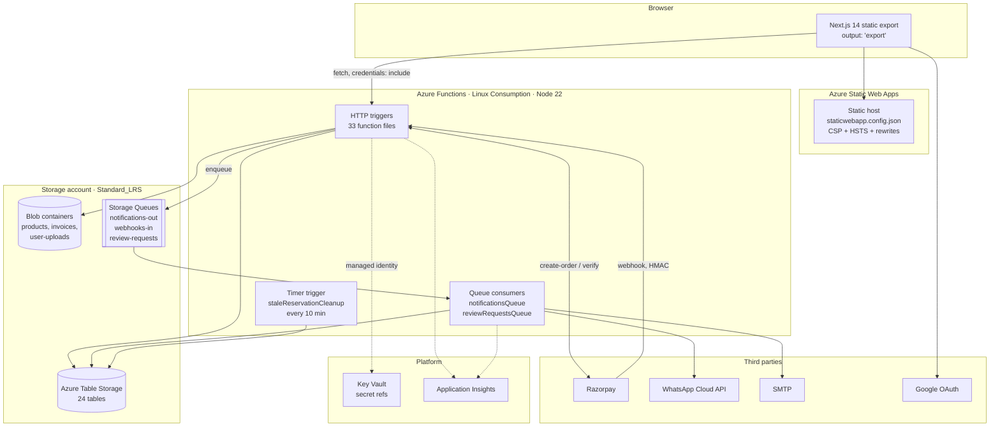
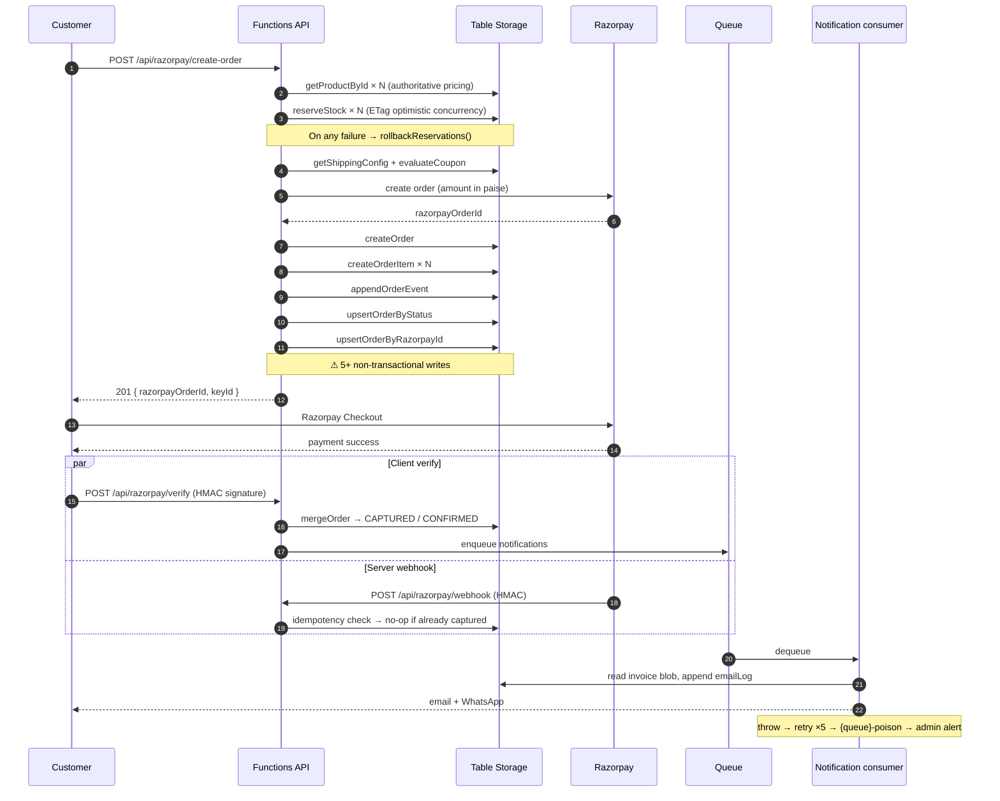
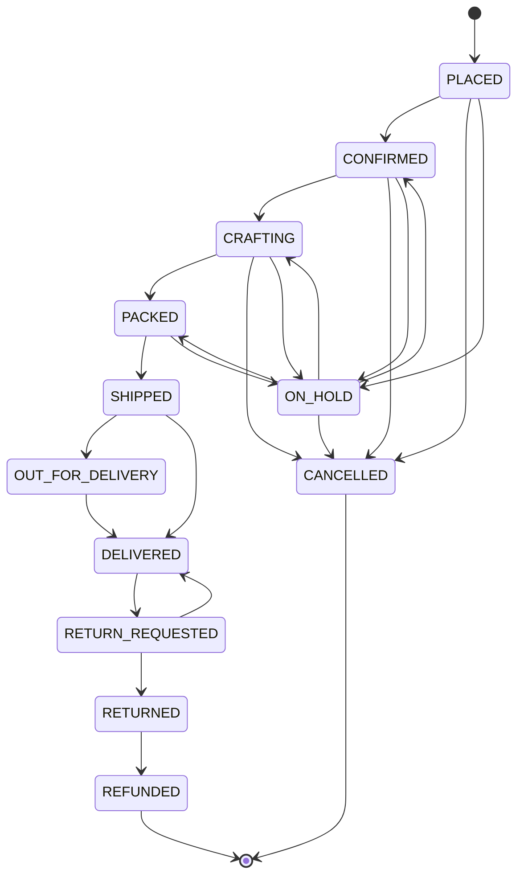
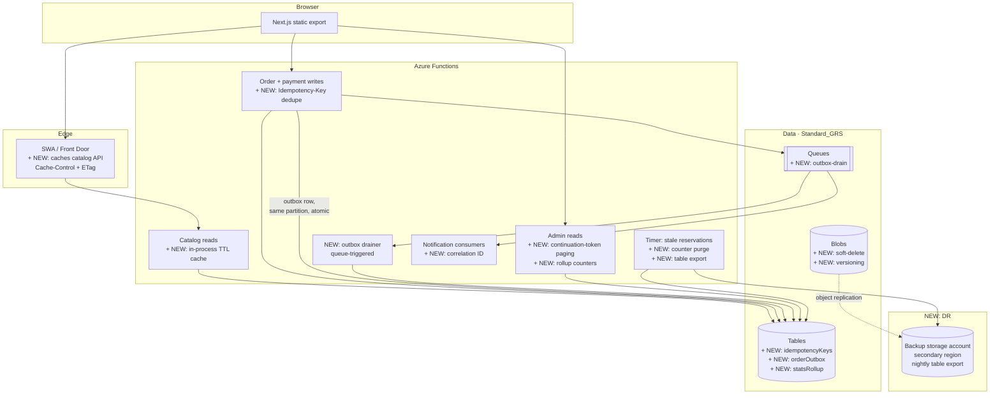
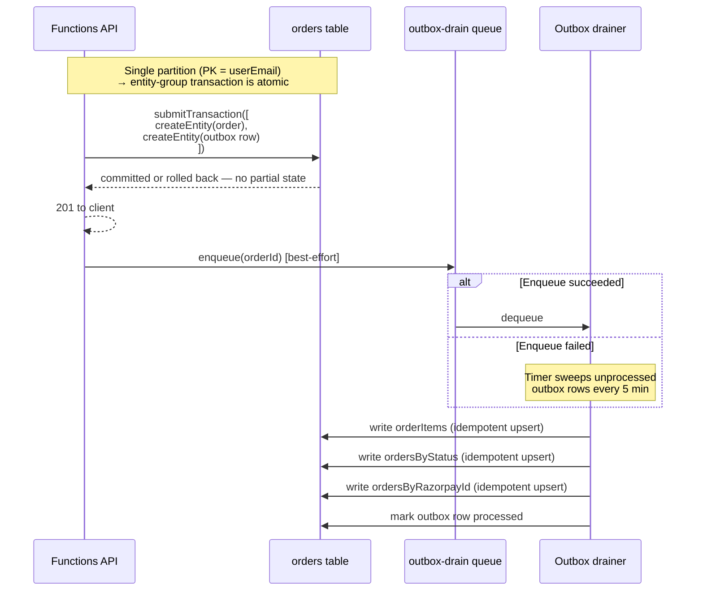

# System Design Review — The Srilatha Arts

**Reviewer perspective:** Senior System Designer
**Date:** 2026-07-25
**Scope:** Full stack — `frontend/`, `backend/`, `infra/`, `.github/workflows/`
**Method:** Static read of the codebase. No runtime profiling, no load test, no live Azure inspection.

---

## 1. Executive summary

This is a **well-built small system with a clear architecture and unusually good documentation-in-code**. The layering is clean, the payment path is thoughtfully defended, and the operational tooling (health probes, poison queues, admin alerting, OIDC deploys) is well beyond what a project this size normally has.

The design principles it honours well: separation of concerns, server-authoritative pricing, idempotency on external callbacks, compensating transactions, defence in depth.

The design principles it does **not** yet honour: bounded work per request, a single source of truth for data, a defined durability posture, and declarative infrastructure.

| Dimension | Rating | One-line verdict |
|---|---|---|
| Separation of concerns | **Strong** | Routes → services → storage, clean. A few god-files. |
| Correctness / consistency | **Adequate** | Good saga thinking; no transactional boundary, dual sources of truth. |
| Scalability | **Weak** | Full-table scans on admin + catalog paths; no caching. |
| Reliability / DR | **Weak** | Single region, LRS, no backup or restore plan. |
| Security | **Strong** | Managed identity, CSP, CSRF, correct IP extraction. JWT revocation missing. |
| Observability | **Adequate** | App Insights wired; probes are shallow, no correlation IDs. |
| Deployability | **Adequate** | OIDC + fallback path is clever, but mutates prod settings; no rollback. |
| Testability | **Weak** | ~12 unit tests for ~17k backend lines; riskiest files untested. |
| Cost efficiency | **Strong** | Consumption + Table Storage + SWA is near-optimal for the volume. |

**The single highest-value change:** put a cache in front of the catalog and stop scanning whole tables. It is the cheapest fix and removes the steepest part of the cost/latency curve.

**The single highest-risk gap:** no backup, no restore drill, and `Standard_LRS` on the storage account that holds every order, invoice and customer record.

---

## 2. Current architecture



### Layering

```
functions/*.ts     HTTP + timer + queue triggers. Route registration, request
                   parsing, response shaping.
middleware/*.ts    adminGuard, userGuard, csrfGuard — pure request inspection.
services/*.ts      Business logic + external clients. tableStorage.ts is the
                   single data-access module (1048 lines, 24 tables).
utils/*.ts         response (CORS/JSON), clientIp, telemetry.
types/index.ts     Shared domain types.
```

This is a sound layering. `orderState.ts` being a pure, I/O-free, unit-tested state machine is exactly right.

### The order lifecycle (the system's core flow)



### Order state machine (`services/orderState.ts`)



Explicit, total, and pure. This is the strongest single piece of design in the codebase.

---

## 3. What the design gets right

**Server-authoritative pricing.** `payments.ts:117-141` re-derives every price from the product row and never trusts the client. Coupons are re-evaluated server-side at `payments.ts:196-218` even though the cart already previewed them. This is the correct trust boundary.

**Compensating transactions for inventory.** `reserveStock` uses ETag optimistic concurrency with bounded retry (`tableStorage.ts:152-202`). Failures trigger `rollbackReservations()`, and a timer-triggered sweeper (`staleReservationCleanup.ts`) catches whatever the inline rollback misses. Two layers, with the second explicitly designed to cover the first's failure modes.

**Idempotency on external callbacks.** Both the verify and webhook paths short-circuit on already-captured payments (`payments.ts:430`, `payments.ts:711-726`). Razorpay retries are safe.

**The captured-after-cancel race is handled.** A payment arriving after the sweeper cancelled the order triggers an auto-refund, an audit event, and an admin alert, and explicitly suppresses customer confirmations. Most systems this size do not think this far ahead.

**Secondary indexes instead of scans — where it matters.** `ordersByStatus` and `ordersByRazorpayId` turn what would be O(table) lookups into point reads, with documented scan fallbacks.

**Append-only audit trail.** `orderEvents` is write-only and partitioned by order ID. Correct pattern for a financial record.

**Identity-based auth throughout.** `DefaultAzureCredential` everywhere, Key Vault references for secrets, OIDC federation for CI. No connection strings in app settings, no publish profile in GitHub secrets.

**Correct client-IP extraction.** `utils/clientIp.ts` reads `x-azure-clientip` first and the *rightmost* `x-forwarded-for` entry second, with the reasoning documented. This is the detail almost everyone gets wrong.

**A genuinely useful health endpoint.** Structured probes, per-dependency detail, `503` only when the critical dependency fails.

---

## 4. Findings

Severity reflects likelihood × business impact at current and near-term scale.

### CRITICAL

---

#### C-1 · No transactional boundary in order creation

**Where:** `backend/src/functions/payments.ts:284-326`

Order creation performs at least five independent writes across four tables:

```
createOrder            → orders
createOrderItem × N    → orderItems
appendOrderEvent       → orderEvents
upsertOrderByStatus    → ordersByStatus
upsertOrderByRazorpayId → ordersByRazorpayId
```

Azure Table Storage supports entity-group transactions only within a single partition of a single table. None of these share both. A crash, timeout, or cold-start eviction between any two leaves a partially-written order.

The stale-reservation sweeper only recovers *stock*. There is no reconciliation for an order row that exists without its `orderItems`, or an order missing from `ordersByStatus` (invisible in the admin list), or missing from `ordersByRazorpayId` (falls back to a full scan on every webhook for that order, forever).

**Recommendation:** Adopt a transactional outbox. Write one self-contained order row containing everything needed to rebuild the derived rows, plus an `outbox` row in the same partition (single-partition ETG, atomic). A queue consumer drains the outbox and writes the projections idempotently. Alternatively, move orders to Cosmos DB or PostgreSQL where a real transaction exists.

---

#### C-2 · No request idempotency on order creation

**Where:** `backend/src/functions/payments.ts:55` — `POST /api/razorpay/create-order`

There is no `Idempotency-Key`. A double-clicked checkout button, a client retry on a slow response, or a mobile network replay creates **two internal orders and reserves stock twice**.

For one-of-one artwork this is not a cosmetic duplicate — it takes the only unit off the shelf twice, and the second reservation is held for 30 minutes until the sweeper releases it. A customer can lock themselves out of the piece they are trying to buy.

The codebase carefully implements idempotency on the *inbound* webhook side but not on the *client* side, where the retry pressure is actually higher.

**Recommendation:** Require an `Idempotency-Key` header. Store `key → {orderId, response, expiresAt}` in a dedicated table with the key as RowKey; `createEntity` throwing 409 is the dedupe signal. Return the stored response on replay.

---

#### C-3 · No backup, no restore plan, no defined RPO/RTO

**Where:** `infra/Deploy-Infrastructure-v2.ps1:458` — `-SkuName 'Standard_LRS'`

The storage account holds every order, every invoice PDF, every customer record, and the entire product catalog. The provisioning script contains no reference to backup, soft-delete, blob versioning, point-in-time restore, or geo-redundancy. A grep for `backup|softDelete|point-in-time|restore` returns nothing.

`Standard_LRS` protects against disk failure within one datacenter. It does not protect against accidental deletion, a bad migration script, ransomware on a compromised credential, or regional loss. There is no documented restore procedure and no evidence of a restore drill.

Additionally: everything lives in one storage account in one region. Tables, blobs, and queues share a single failure domain and a single throughput budget.

**Recommendation, in order:**
1. Enable blob soft-delete + versioning + container soft-delete today. Minutes of work.
2. Enable Table Storage point-in-time restore, or add a scheduled export of all tables to a separate storage account in a different region.
3. Move to `Standard_GRS` or `Standard_RAGRS` for the account holding orders and invoices.
4. Write down the RPO and RTO you are actually willing to accept, then run one restore drill and time it. An untested backup is not a backup.

---

### HIGH

---

#### H-1 · Full-table scans on hot and admin paths

**Where:**

| Call site | Effect |
|---|---|
| `functions/orderAdmin.ts:144` | `getAllOrders()` then filter + paginate in memory |
| `functions/adminStats.ts:29` | `getAllOrders()` for aggregate stats |
| `functions/adminCustomers.ts:46` | `getAllOrders()` to build a customer list |
| `functions/adminDiagnostics.ts:583` | `getAllOrders()` |
| `functions/payments.ts:413, 698` | `getAllOrders()` as index-miss fallback |
| `functions/products.ts:73` | `getAllProducts()` on every uncategorised catalog request |
| `services/tableStorage.ts:53-63` | `listPaginated` loads **all** rows then `.slice()` |

`listPaginated` is the sharpest edge — it presents a pagination API while doing none of the work pagination exists to avoid. Page 1 of the audit log costs the same as reading the entire audit log.

Azure Table Storage has no server-side aggregation, no `COUNT`, and no cross-partition sort. Every one of these grows linearly with total history and will not degrade gracefully — it will be fine, then fine, then time out.

**Recommendation:**
- Replace `listPaginated` with continuation-token pagination (`byPage({ maxPageSize })`) and pass the token to the client. Drop `total`, or maintain it as a counter row.
- Maintain rollup counters for `adminStats` incrementally on order transitions instead of recomputing.
- Add a `customers` projection table rather than deriving it from all orders.
- Instrument the scan-fallback paths in `payments.ts` with a metric and alert on any non-zero rate — a silent index miss becomes a permanent full scan on every webhook.

---

#### H-2 · No caching anywhere on the catalog read path

**Where:** `backend/src/functions/products.ts:75, 95`

`/api/products` and `/api/products/{id}` return `jsonResponse(..., 200, {}, origin)` — **no `Cache-Control`, no `ETag`, no `Last-Modified`**. Other endpoints in the codebase do set cache headers (`announcements.ts:70`, `reviews.ts:81`, `pincode.ts:109`), so the omission on the hottest path looks accidental rather than deliberate.

Consequence: every product-grid render, every PDP view, every bot crawl performs a full Table Storage read, deserialisation, sort, and filter inside a Consumption-plan function. The catalog is read-mostly and changes a few times a week.

There is also no in-process TTL cache, so even two requests landing on the same warm instance one second apart both hit storage.

**Recommendation:**
- `Cache-Control: public, max-age=60, s-maxage=300, stale-while-revalidate=600` on catalog reads. One line each.
- Add an `ETag` derived from the max `updatedAt` across the result and honour `If-None-Match` → `304`.
- Add a module-scope TTL cache (30–60s) in `tableStorage.ts` for `getAllProducts()`. Invalidate on `upsertProduct`/`deleteProduct`.
- Optionally route catalog reads through the SWA/Front Door edge so the CDN absorbs them entirely.

This is the highest benefit-to-effort item in the review.

---

#### H-3 · Stateless JWTs with no revocation

**Where:** `backend/src/services/auth.ts:14-24`

Tokens are signed with a single `JWT_SECRET`, 2h for customers and 24h for admins, with no `jti`, no version claim, and no server-side denylist. `buildClearCookie()` clears the browser cookie; the token itself stays valid until expiry.

Concretely: a leaked admin token is valid for up to 24 hours and cannot be revoked. Firing a staff member, deleting an admin, or changing a password does not invalidate their live session. The only lever is rotating `JWT_SECRET`, which logs out every user simultaneously and has no dual-key grace window.

**Recommendation:**
- Add a `tokenVersion` integer on the user/admin row, embed it in the JWT, and compare in `requireUser`/`requireAdmin`. Bump it on logout-all, password change, and de-provisioning. One extra point read on authenticated requests — acceptable at this volume, and cacheable.
- Shorten the admin token to 1h and add a refresh token if that hurts UX.
- Support two signing keys (`JWT_SECRET` + `JWT_SECRET_PREVIOUS`) so rotation is not a mass logout.

---

#### H-4 · The rate limiter is not atomic and grows without bound

**Where:** `backend/src/services/rateLimit.ts:21-55`

`checkAndIncrement` does read → compute → `upsertEntity` with **no ETag precondition**. Concurrent requests read the same count and both write `count + 1`, so N parallel attempts register as one. The limit that protects the login endpoint from credential stuffing is precisely the limit that concurrency defeats.

Secondary problems: two storage round-trips on every auth attempt (latency on the hot path), and Table Storage has no TTL — expired counters are only deleted on successful login (`resetRateLimit`), so the `rateLimits` table accumulates one permanent row per distinct attacking IP.

**Recommendation:** Pass the ETag on the update and retry on 412, mirroring the pattern already used correctly in `reserveStock`. Add a timer-triggered purge for counters older than the longest window. If auth volume grows, move counters to Redis where `INCR` is atomic and TTL is native.

---

### MEDIUM

---

#### M-1 · Two sources of truth for order items

**Where:** `payments.ts:266` (`items: JSON.stringify(itemSnapshots)`) and `payments.ts:286-292` (`createOrderItem` per item)

The same snapshot is written into a JSON blob on the order row *and* into the `orderItems` table. Nothing enforces agreement. A partial write (see C-1) or a future code path that updates one and not the other produces an order whose invoice and admin view disagree — on a financial record.

**Recommendation:** Pick one. The embedded JSON is sufficient for reads and is atomic with the order row; `orderItems` earns its place only if you need per-product queries across orders — in which case make it an explicitly derived projection rebuilt from the order row, never edited independently.

---

#### M-2 · Product ID format is load-bearing for partition routing

**Where:** `backend/src/services/tableStorage.ts:87-92`

```ts
const category = productId.slice(0, -9)
return getProduct(category, productId)
```

The partition key is derived by string-slicing the last nine characters off the ID. This makes the ID *format* a storage-layer contract. Any ID not matching `<category>-<8hex>` silently queries the wrong partition and returns a 404 that looks like "product deleted".

Renaming a category, or ever issuing an ID with a different shape, breaks lookups with no error — only absence.

**Recommendation:** Validate the shape and throw explicitly on mismatch rather than returning `null`. Better: add a `productIndex` table (`PK='idx'`, `RK=productId`, `category`) so the mapping is data, not a string operation. Best long-term: stop encoding routing information in identifiers.

---

#### M-3 · Schema provisioning has two competing sources of truth

**Where:** `tableStorage.ts:21-38` (`ensureTable`) vs `infra/Deploy-Infrastructure-v2.ps1:182` (`$tableNames`)

Tables are created lazily at runtime by `ensureTable` *and* declaratively by the deploy script. The runtime path is applied inconsistently — `cart`, `wishlist`, `emailLogs`, `whatsappMessages`, `announcements`, `ordersByRazorpayId` use it; `orders`, `products`, `users`, `reviews` do not. Which mechanism actually created a given table in a given environment is unknowable from the code.

The self-healing is pragmatic and the comment explains why. But it means the deploy script is not authoritative, so "is this environment correctly provisioned?" has no answer.

**Recommendation:** Keep `ensureTable` as a dev-only convenience gated on an env flag, or apply it uniformly to all 24 tables and delete the `$tableNames` list. Either is defensible; having both is not.

---

#### M-4 · Infrastructure is imperative, not declarative

**Where:** `infra/` — ~1,500 lines of PowerShell, no Bicep or Terraform. `README.md:12` claims "Bicep + scripts"; `find infra -name '*.bicep'` returns nothing.

The script is genuinely careful — nine phases, per-phase idempotency notes, existence checks before every write. That is a lot of hand-written machinery to replicate what a declarative tool provides for free: a plan/preview step, drift detection, and a state file that says what *should* exist.

Practical consequences: no way to preview a change before applying it, no drift detection, idempotency correctness rests on the author's discipline in every new phase, and the README describes infrastructure that does not exist.

**Recommendation:** Fix the README today. Then port resource *provisioning* (Phases 2, 4) to Bicep and keep PowerShell only for what Bicep genuinely cannot do (RBAC propagation waits, secret seeding, the CI service-principal federation in Phase 9). This is a multi-day task — schedule it, do not rush it.

---

#### M-5 · CI mutates production app settings and restarts the app mid-deploy

**Where:** `.github/workflows/deploy-backend-prd.yml` — "Ensure RunFromPackage=1" and the fallback step

The workflow reads `WEBSITE_RUN_FROM_PACKAGE`, and on drift **writes it and restarts production**, then polls `/api/health` for up to 300 seconds before deploying. The fallback path deliberately sets that setting to a blob URL, leaving the app in a *different* steady state than the primary path, self-corrected on some later run.

The engineering is good — the retry, the health gate, and the SAS-free managed-identity blob download are all well judged. The design concern is that configuration is being mutated by the deploy pipeline, so the app has two valid production configurations and which one is live depends on deploy history. There is also no deployment slot, so every deploy is in-place with a cold-start window, and rollback means re-running an older commit's workflow.

**Recommendation:** Make `WEBSITE_RUN_FROM_PACKAGE` owned solely by the infra script and have CI *assert* rather than *correct* it — fail loudly on drift. Treat the blob fallback as a break-glass `workflow_dispatch` path, not an automatic one. If payment-path availability matters, the Premium plan buys deployment slots and eliminates cold starts; price it against a lost checkout.

---

#### M-6 · CORS returns a header for disallowed origins

**Where:** `backend/src/utils/response.ts:11-12`

```ts
const matched = origin && allowedOrigins.includes(origin) ? origin : allowedOrigins[0] || ''
```

When the request origin is not allowlisted, the response still carries `Access-Control-Allow-Origin: <first allowed origin>` plus `Allow-Credentials: true`. Browsers reject the mismatch, so this is not directly exploitable — but the correct behaviour is to **omit** the header entirely. Emitting a valid-looking CORS header for a rejected origin makes the allowlist harder to reason about and harder to test.

**Recommendation:** Return `{}` for the CORS headers when the origin is absent from the allowlist.

---

#### M-7 · The captured-after-cancel handler is duplicated

**Where:** `payments.ts:442-520` (verify path) and `payments.ts:755-836` (webhook path)

Roughly 80 lines of near-identical refund + audit + alert logic, copy-pasted. The two copies already differ in small ways (the webhook passes `amountPaise`, the verify path does not). A future policy change to refunds must be made in exactly two places, and nothing enforces it.

This is the symptom; `payments.ts` at 1,077 lines mixing HTTP concerns, payment orchestration, refund policy, and index maintenance is the cause.

**Recommendation:** Extract `handlePaymentAfterCancellation(order, paymentId, amountPaise, source)` into `services/`. It is pure orchestration and directly unit-testable.

---

#### M-8 · Health probes report configuration, not reachability

**Where:** `backend/src/functions/health.ts:69-107`

`probeRazorpay`, `probeWhatsApp`, and `probeEmail` check that environment variables are set and that the Razorpay key matches a regex. They make no network call. The endpoint can return `status: "ok"` while Razorpay is down, the WhatsApp token is expired, or SMTP is refusing connections.

This is a defensible trade-off for a probe polled every few minutes — the comment says as much. But an availability test wired to a probe that cannot detect the most likely outage provides false assurance.

**Recommendation:** Add a separate `/api/health/deep` with real, cached upstream checks (60s TTL), and point a lower-frequency availability test at it. Keep the shallow probe for liveness.

---

### LOW

---

**L-1 · No API versioning.** Routes are `/api/products`, not `/api/v1/products`. Frontend and backend deploy through independent workflows with independent triggers, so version skew is not merely possible — it is the normal state during any deploy. There is no contract test between them. Add `/v1` before you have external consumers, and add a contract test now.

**L-2 · Credential objects constructed per-call.** `new DefaultAzureCredential()` appears inside `probeStorage` (`health.ts:50`) and inside both client factories in `staleReservationCleanup.ts:52, 60`, rather than at module scope as in `tableStorage.ts:5` and `queue.ts:10`. Each construction re-runs credential-chain discovery. Minor, but it is on a cold-start-sensitive platform.

**L-3 · Queue messages never expire.** `queue.ts:27` sets `messageTimeToLive: -1`. A message that can never succeed persists indefinitely. Prefer a finite TTL (7 days) so the poison queue is bounded.

**L-4 · Test coverage is thin where risk is highest.** Twelve backend unit tests cover ~17,000 lines. The three largest and riskiest files — `payments.ts` (1,077), `notificationsQueue.ts` (975), `orderAdmin.ts` (760) — have no direct tests. There is no integration test against Azurite; the Playwright E2E suite assumes a manually-started local stack. The pure functions that *are* tested (`orderState`, `csrf`, `rateLimit`, `couponEvaluation`) are the easy ones.

**L-5 · Telemetry sampling can drop exceptions.** `host.json` enables adaptive sampling with only `Request` excluded. Under a burst — exactly when you need the data — exceptions and custom events are sampled away. Exclude `Exception` at minimum.

**L-6 · No correlation ID across the async boundary.** Queue messages carry `{userEmail, channel, templateKey, vars}` with no trace context, so an App Insights trace ends at the enqueue and a fresh one begins at the consumer. Add `operation_Id` to the message envelope and set it on the consumer's telemetry context.

**L-7 · Secret rotation is partial.** Razorpay keys have dedicated rotation scripts. `JWT_SECRET`, `CSRF_SIGNING_KEY`, and `INVOICE_SIGNING_KEY` have none, and rotating any of them is a breaking event with no dual-key window. `INVOICE_SIGNING_KEY` is the one to fix first — invoice URLs are long-lived and already in customers' inboxes.

---

## 5. Target-state architecture

The changes below are additive. Nothing in the current design needs to be thrown away.



### The outbox pattern for C-1



The key property: the order row and its intent-to-project commit together or not at all. Everything downstream is an idempotent retry.

---

## 6. Prioritised roadmap

Sequenced by risk reduction per unit of effort, not by severity label.

### Phase 0 — This week (hours, not days)

| # | Action | Fixes |
|---|---|---|
| 1 | Enable blob soft-delete, container soft-delete, and blob versioning | C-3 |
| 2 | Add `Cache-Control` + `ETag` to `/api/products` and `/api/products/{id}` | H-2 |
| 3 | Fix `corsHeaders` to omit ACAO for non-allowlisted origins | M-6 |
| 4 | Exclude `Exception` from App Insights sampling in `host.json` | L-5 |
| 5 | Correct the README's Bicep claim | M-4 |
| 6 | Hoist `DefaultAzureCredential` to module scope in `health.ts` and `staleReservationCleanup.ts` | L-2 |

### Phase 1 — Weeks 1–3 (correctness and durability)

| # | Action | Fixes |
|---|---|---|
| 7 | `Idempotency-Key` on `POST /razorpay/create-order` + `idempotencyKeys` table | C-2 |
| 8 | ETag precondition + 412 retry in `checkAndIncrement`; timer purge for stale counters | H-4 |
| 9 | Nightly table export to a secondary-region storage account; **run one restore drill** | C-3 |
| 10 | `tokenVersion` claim checked in both guards; dual-signing-key support | H-3 |
| 11 | Extract `handlePaymentAfterCancellation` from both copies | M-7 |
| 12 | Unit tests for `payments.ts` order-creation and both capture paths | L-4 |

### Phase 2 — Weeks 4–8 (scale and consistency)

| # | Action | Fixes |
|---|---|---|
| 13 | Transactional outbox for order creation + drainer + sweeper | C-1 |
| 14 | Continuation-token pagination replacing `listPaginated`; drop or denormalise `total` | H-1 |
| 15 | `statsRollup` counters updated on transitions; remove `getAllOrders()` from `adminStats` | H-1 |
| 16 | `customers` projection table; remove `getAllOrders()` from `adminCustomers` | H-1 |
| 17 | Alert on any non-zero scan-fallback rate in `payments.ts` | H-1 |
| 18 | In-process TTL cache for `getAllProducts()` with write-through invalidation | H-2 |
| 19 | Collapse `order.items` / `orderItems` to one source of truth | M-1 |
| 20 | Integration tests against Azurite in CI | L-4 |

### Phase 3 — Quarter (platform maturity)

| # | Action | Fixes |
|---|---|---|
| 21 | Port resource provisioning to Bicep; keep PowerShell for RBAC/secrets/OIDC only | M-4 |
| 22 | Move to `Standard_GRS`; document RPO/RTO; schedule recurring restore drills | C-3 |
| 23 | Evaluate Premium plan for deployment slots + no cold starts on the payment path | M-5 |
| 24 | `/v1` route prefix + a frontend↔backend contract test in CI | L-1 |
| 25 | Correlation IDs through queue envelopes | L-6 |
| 26 | `/api/health/deep` with cached real upstream checks | M-8 |
| 27 | `productIndex` table; stop deriving partition keys by string slicing | M-2 |
| 28 | Resolve `ensureTable` vs `$tableNames` to a single provisioning authority | M-3 |
| 29 | Rotation runbooks + dual-key windows for `JWT_SECRET`, `CSRF_SIGNING_KEY`, `INVOICE_SIGNING_KEY` | L-7 |

---

## 7. The question behind the findings: is Table Storage still the right choice?

It was clearly the right choice at the start. It is cheap, it is durable, and the partition strategy here is thoughtful — `orders` partitioned by `userEmail` gives fast per-customer reads, and the two secondary index tables cover the access patterns that partitioning alone could not.

But a pattern runs through C-1, H-1, and M-1: **the workarounds are accumulating.** No transactions across tables → hand-rolled sagas and compensating loops. No secondary indexes → manually maintained index tables that can drift. No aggregation → full scans. No cross-partition sort → sort in application memory. No TTL → timer functions to garbage-collect.

Each individual workaround is well executed. Collectively they are a growing tax on every new feature, and each one is a place correctness can quietly slip.

**This is a "know your trigger" decision, not a "migrate now" one.** Migrate when any of these becomes true:

- Order volume exceeds roughly 10,000 rows and admin pages feel slow
- You need a second aggregate view that would require another scan
- You need a real multi-table transaction to ship a feature
- Reporting requirements arrive that need joins or `GROUP BY`

At that point Azure SQL Database (Basic/Serverless, single-digit dollars per month at this scale) gives transactions, indexes, aggregates and joins, and removes categories 1, 3 and 5 of the workaround list outright. Cosmos DB is the alternative if you want to keep the NoSQL model and gain multi-region writes, but it does not remove the aggregation problem.

Do not migrate reactively during an outage. Decide the trigger now, write it down, and revisit quarterly.

---

## 8. Scorecard

| Principle | Score | Evidence |
|---|---|---|
| **Separation of concerns** | 8/10 | Clean layering; `payments.ts` and `tableStorage.ts` are god-files |
| **Single responsibility** | 6/10 | Services are focused; route handlers do orchestration inline |
| **Single source of truth** | 5/10 | M-1 (dual item storage), M-3 (dual provisioning) |
| **Bounded work per request** | 3/10 | H-1 — several endpoints are O(total history) |
| **Idempotency** | 7/10 | Excellent inbound; absent on client-initiated writes (C-2) |
| **Transactional integrity** | 4/10 | C-1 — no boundary; sagas cover stock only |
| **Fault tolerance** | 7/10 | Retries, poison queues, compensating loops, sweepers |
| **Disaster recovery** | 2/10 | C-3 — no backup, no drill, LRS, single region |
| **Security posture** | 8/10 | MI, KV, CSP, CSRF, correct IP; JWT revocation missing (H-3) |
| **Observability** | 6/10 | App Insights wired; shallow probes, no correlation IDs, sampling risk |
| **Deployability** | 6/10 | OIDC + fallback is clever; mutates config, no slots, no rollback |
| **Testability** | 4/10 | Pure functions tested; the risky 3,000 lines are not |
| **Cost efficiency** | 9/10 | Right platform choices for the volume |
| **Documentation** | 9/10 | In-code rationale is exceptional; README has drifted |

**Overall: 6.0/10** — a solid, carefully-reasoned system that is currently under-engineered in exactly two places that matter most: durability of the business record, and bounded cost per request.

---

## 9. What I would fix first, if you only did one thing

Enable blob soft-delete and versioning, and schedule a nightly table export to a second region. It takes under an hour and it is the difference between a bad day and the end of the business.

Everything else on this list is about making the system faster, cleaner, or easier to change. That one is about making sure there is still a system to change.

---

*Reviewed against the codebase at `docs/` sibling revision, 2026-07-25. Findings cite file and line; re-verify line numbers after any refactor.*
